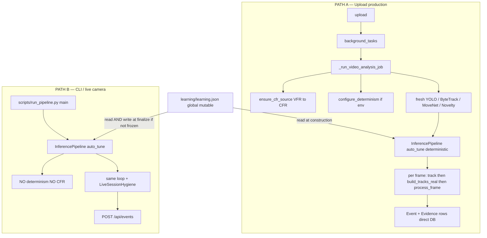

# COMPREHENSIVE REPAIR AND ARCHITECTURE PLAN — Motared / Littering Detection

**Document role:** Authoritative architecture + reproducibility + repair roadmap.  
**Created:** 2026-09-14  
**Repository:** Motared (`D:\HO`)  
**Scope of this document:** Analysis + verification measurements. Does **not** authorize silent production-logic changes.  
**Measurement runs:** see §26 (appended after this plan was executed on 2026-09-14).

---

## 0. Evidence legend (used throughout)

| Tag | Meaning |
|-----|---------|
| **PROVEN BY CODE** | Exact lines were read. |
| **PROVEN BY TEST** | A test pins the behavior (test body read). |
| **PROVEN BY TEST-RUN** | pytest (or equivalent) was executed and recorded in §26. |
| **PROVEN BY MEASUREMENT** | Same-video / path / learning experiments recorded in §26. |
| **INFERRED** | Strong deduction from code; upgraded when §26 supplies numbers. |
| **NOT VERIFIED** | Needs runtime / hardware not available in this session. |
| **REAL-VIDEO** | Decision verified on a real clip under a named harness. |
| **PRODUCTION READY** | Not claimed in this document. |

---

## 1. Executive summary

The system is architecturally sound and matches its stated product goal far better than a "chaotic" project would: detection → tracking → stable identity → ownership → temporal FSM → evidence → DB → dashboard is really implemented, in that order, and the FSM is the single authority for confirmation. `docs/ARCHITECTURE.md:33-53` The dashboard is genuinely event-first (`ForensicAssetPanel` primary, full analyzed video collapsed under Technical Review). `AnalysisDetail.tsx:423-450`

The "same video, different result on different days" problem is real and has three overlapping causes, ranked by strength:

1. **`learning/learning.json` is global mutable state** read at every detector construction and applied to tier-0 thresholds, regardless of determinism. Any run that writes it (CLI/live path, or any run with `MOTARED_DETERMINISTIC=0`) changes the thresholds that a later "identical" upload uses. This is the strongest explanation. `adaptive_tuner.py:345-349`
2. **Two entry paths diverge:** upload applies CFR normalization + determinism; the CLI/live path (`scripts/run_pipeline.py`) applies neither. Same file → different decision by path. `run_pipeline.py:174-197`
3. **Residual GPU nondeterminism:** `torch.use_deterministic_algorithms(True, warn_only=True)` permits nondeterministic CUDA kernels instead of erroring. `runtime_determinism.py:58`

Per-video auto-calibration mutates thresholds mid-run, but deterministically for identical frames — it is an amplifier of cause #2, not an independent RNG source. `littering_event_detector.py:1541-1554`

The recall bottleneck is dominated by temporal-logic gates (carry-latch, release, ground confirmation), not detector recall — confirmed by the whole "REPAIR-P0-01" history and the config comments. The correct next step is **NOT** retraining YOLO. `MASTER_REPAIR_PLAN.md:26-36`

Bin-vs-ground is only partially solved: there is no bin detector; the distinction relies on a ground-plane heuristic plus optional operator-drawn zones that are empty by default. `events.yaml:54-57`

---

## 2. Actual product goal (as encoded in code)

The non-negotiable contract is encoded in the rejection reasons and config: confirm only **PERSON → CARRY → RELEASE → GROUND → DEPART/ABANDON**, and reject bin deposits, pick-ups, passers-by, and unowned ground objects. `MASTER_REPAIR_PLAN.md:46-55` The FSM states and rejection enums mirror this exactly. `littering_event_detector.py:51-91`

---

## 3. Complete current architecture (real, not aspirational)



Key modules and their real roles:

| Module | Role | Evidence |
|--------|------|----------|
| `_run_video_analysis_job` | Real production entry; CFR, determinism, fresh objects, direct DB | `analysis.py:600-601` |
| `InferencePipeline.process_frame` | Buffer, throttle to `analysis_fps`, event detector, evidence start | `pipeline.py:205-261` |
| `LitteringEventDetector` | Authoritative FSM | `littering_event_detector.py:1058-1067` |
| `AdaptiveEventDetector` | Tier ladder + learning store | `adaptive_tuner.py:307-315` |
| `ObjectIdentityManager` / `PersonIdentityManager` | Stable UIDs across churn | `object_identity.py:55-67` |
| `YoloDetector` | COCO person + `best.pt` litter + optional bag + HSV + novelty | `yolo_detector.py:218-253` |
| `write_event_evidence_package` | Crops/clip/stills from ORIGINAL video | `evidence_package.py:318-338` |

---

## 4. End-to-end data flow (one frame → dashboard event)

`detector.track(persist=True)` → `build_tracks_real` → `pipe.process_frame` → `event_detector.update` (semantic split, UIDs, calibrate, pairs, rebind, FSM) → on confirm `_start_evidence_for_detector_event` → after loop backend cluster-dedups → `Event` + artifacts + `write_event_evidence_package` → dashboard. `analysis.py:880-894` `littering_event_detector.py:1206-1216` `analysis.py:1106-1149`

**Source of truth for event time:** `dev.timestamps["confirmed"]` or `["departure"]` — FSM timestamps from decoded packet time. CFR-relative on Path A; raw on Path B. `pipeline.py:310-317`

---

## 5–6. The FSM: semantics and math

**States:** `NO_BAG` → `BAG_NEAR_PERSON` → `BAG_CARRIED` → `BAG_RELEASED` → `BAG_ON_GROUND` → `PERSON_DEPARTED` → `VIOLATION_CONFIRMED`, with `PICKED_BACK_UP` reversion. `littering_event_detector.py:51-59`

**Per-tick geometry (`_evaluate_pair`):**

- `near = norm_distance ≤ near_distance_ratio OR containment ≥ 0.25 OR carry_zone` — `littering_event_detector.py:1710`
- `carried = (wrist_near OR zone_carry) AND norm_distance ≤ 1.5·near_distance_ratio AND moves_with_person` — `littering_event_detector.py:1721-1725`
- Uncarriable-object gate rejects dumpster/large pairs — `littering_event_detector.py:1641-1644`

**Transitions (`_advance_pair`):**

- Near → Carried: `carried_frames ≥ min_carried_frames` + carry-origin link; identity frozen — `littering_event_detector.py:2213-2239`
- Carried → Released: `(geo_release AND aidm_ok) OR aidm_separation` — `littering_event_detector.py:2244-2270`
- Released → Ground: stationary / settle streak — `littering_event_detector.py:2299-2321`
- Ground → Departed: departure OR abandonment; then `_evaluate_confirmation` — `littering_event_detector.py:2367-2392`
- `smooth_regrab` reverts to `BAG_CARRIED` — `littering_event_detector.py:2348-2366`

**Final gate ladder (`_rejection_reason`, order matters):** bag-not-detected → fallback-gap → low-conf → person-not-seen → not-enough-carried → no-release → not-stationary/did-not-depart → other-person-closer → ambiguous → bin-zone/bin-disposal → physical-separation → confidence. `littering_event_detector.py:2794-2894`

**Does DETECTION leak into VIOLATION?** Mostly no — proposals are split out; only semantic waste forms pairs. `littering_event_detector.py:1155-1160` Low conf / detector gaps can still reject real events (recall loss).

---

## 7. Thresholds: static vs dynamic vs learned

| Kind | Examples | Evidence |
|------|----------|----------|
| Static (`events.yaml`) | `min_carried_frames=6`, `min_stationary_frames=8`, `near_distance_ratio=0.25`, `release_distance_ratio=0.35`, `min_event_confidence=0.50`, AIDM ratios, `ground_plane_margin_ratio=0.40` | `events.yaml:8-18`, `61-74` |
| Dynamically calibrated (first ~24 ticks) | `carry_motion_norm_px`, `departure_motion_ratio`; per-pair `release_distance_threshold` | `littering_event_detector.py:1541-1554`, `2140-2144` |
| Learned (`learning.json` → tier-0) | `min_carried_frames`, `release_distance_ratio`, `departure_motion_ratio`, … bounded steps | `adaptive_tuner.py:205-214` |

Observed live store (2026-09-14 snapshot): after **95** videos, `min_carried_frames` learned to **3**, `release_distance_ratio` to **0.12**. `learning/learning.json:21-34`

---

## 8. Persistent vs per-video state (the reproducibility crux)

| State | Category | Reset per video? | Evidence |
|-------|----------|------------------|----------|
| YOLO/ByteTrack/MoveNet/Novelty objects | per-job | Yes (fresh + `reset_tracking`) | `analysis.py:749-753` |
| FSM `_pairs`, identities, histories | per-video | Yes (`reset()` + explicit call) | `littering_event_detector.py:1482-1499` |
| AdaptiveEventDetector tiers | per-job | Yes (constructed per pipeline) | `adaptive_tuner.py:350-353` |
| `learning/learning.json` | **global mutable** | **No** — read every construction; written on non-frozen finalize | `adaptive_tuner.py:345-349` |
| `self.config` via calibration | per-video (intra-run) | Fresh config, mutated during run | `littering_event_detector.py:1543-1546` |
| `event_id` (uuid4) | per-event random | IDs only, not decisions | `littering_event_detector.py:3039-3040` |
| DB Camera `"Video: …"` | persistent | reused by filename | `analysis.py:655-664` |

**Category answers:**

1. **Intentionally persistent:** `learning.json`, DB rows, evidence files, archived videos.
2. **Accidentally persistent (leaks into inference):** `learning.json` **read** path.
3. **Safely reset per video:** all in-memory detector/tracker/FSM state.
4. **Globally shared:** `learning.json`, module-level `_JOB_CANCELLATION_TOKENS`.
5. **Mutable during analysis:** calibration + per-pair release threshold (deterministic given identical frames).

---

## 9. Reproducibility analysis

`configure_determinism` seeds Python/NumPy/torch/TF, sets `CUBLAS_WORKSPACE_CONFIG`, `PYTHONHASHSEED`, TF determinism env, cuDNN deterministic, disables TF32/benchmark. Strong on CPU. `runtime_determinism.py:30-65`

**Two gaps:** `warn_only=True` (GPU) and it is only called on Path A. `analysis.py:651-652`

Dict/set iteration: FSM uses insertion-ordered `_pairs` and sorts primary associations with deterministic tie-break; ObjectIdentityManager sorts by `-area`. **INFERRED → see §26 for any counterexample.** `littering_event_detector.py:1821` `object_identity.py:87-103`

**Reproducibility contract (proposed):** same video + model + config + code + hardware-mode ⇒ identical `{event count, violation decision, actor UID, object UID, event time ±tolerance, evidence availability}`; UUIDs may differ. Achievable on CPU today **only if** `learning.json` is frozen for **reads** too.

---

## 10–11. Root-cause of "same video, different day"

| ID | Priority | Cause | Status |
|----|----------|-------|--------|
| RC-1 | P0 | `learning.json` read leak: `freeze_learning_writes` blocks writes, not reads | **PROVEN BY MEASUREMENT** (§26.2) |
| RC-2 | P1 | Path A (CFR+determinism) vs Path B (neither) | **PROVEN BY CODE**; path comparison in §26.3 |
| RC-3 | P2 | Calibration amplifies frame-timing differences on VFR Path B | **INFERRED** (amplifier) |
| RC-4 | P3 | GPU `warn_only=True` | **PROVEN BY CODE**; GPU runtime **NOT VERIFIED** on this host (CPU Docker) |

**Not a cause:** `event_id` uuid4 (dedup uses person+time). `adaptive_tuner.py:623-631`

---

## 12. Recall bottleneck analysis

Earliest restrictive gates historically starving recall: carry-latch (REPAIR-P0-01), release detection, then ground confirmation (`require_ground_confirmation` with no bin detector → perspective-elevated real drops risk `BIN_DISPOSAL`). `MASTER_REPAIR_PLAN.md:26` `littering_event_detector.py:2860-2893`

For each FN: read first-failing `_rejection_reason`. Do **not** globally lower thresholds; the adaptive tier ladder already exists. `adaptive_tuner.py:14-23`

---

## 13. Detector vs logic failure separation

Report JSON carries per-job diagnosis (`yolo_person` / `yolo_object` / `color_object` / tracking / association / littering_candidate + `no_candidate_reason`). `analysis.py:1361-1372`

**Rule:** if `yolo_object=PASS` but FSM rejects → logic failure (B–J), not a training problem.

---

## 14. Tracking & identity

Object identity: greedy nearest-neighbour with per-frame reservation, class-family gate, `distance_px=220`, `max_age=120`, monotonic never-reused UIDs. **PROVEN BY TEST.** `object_identity.py:74-123` `test_layer1_audit_models.py:64-70`

Ownership freeze at carry; rebind refuses cross-class (REPAIR-P1-02). `littering_event_detector.py:1803-1838`, `1258-1266`

AIDM attach **0.15** / separate **0.20** are empirically clip-tuned (comments cite IMG_5290) — camera-specific; **NOT VERIFIED** for general cameras. `events.yaml:20-28`

---

## 15. Event semantics vs code

| Scenario | Required | Code behavior | Status |
|----------|----------|---------------|--------|
| carry→release→ground→depart | VIOLATION | full FSM path | matches (**PROVEN BY TEST**) `test_littering_event_detector.py:58-94` |
| bin deposit | not violation | `BIN_DISPOSAL` / `BIN_ZONE_DEPOSIT` | partial — no detector `littering_event_detector.py:2856-2893` |
| drop then re-grab | not final | `smooth_regrab` reverts | matches `littering_event_detector.py:2349-2366` |
| carrying only | non-event | stays `BAG_CARRIED` | matches |
| ground object no ownership | non-event | static-clutter gate | matches (**PROVEN BY TEST**) `test_correctness_audit.py:238-256` |
| two objects one person | one only | structural one-bag-per-person | documented limitation `littering_event_detector.py:20-29` |

---

## 16. Evidence contract

Crops/clip/stills cut from ORIGINAL video; `_is_valid_evidence_crop` rejects blank/uniform/tiny; anchored to frozen UIDs; failures return `None`, never fabricated. **PROVEN BY CODE / PROVEN BY TEST.** `evidence_package.py:459-484` `test_critical_product_corrections.py:85-106`

Residual: clip legacy `mp4v` then ffmpeg; if ffmpeg missing, playback risk. **NOT VERIFIED** on all hosts. `evidence_package.py:498-504`

---

## 17. Dashboard contract

`ForensicAssetPanel` primary; analyzed/original under collapsed `DebugReviewPanel`. Telemetry separates active people / unique UIDs / raw track IDs. `analysis.py:426-433`

Gap: FSM checklist may render static "VERIFIED" when a frame is missing — can overstate completeness. `ForensicAssetPanel.tsx:343-345`

---

## 18. Live pipeline / job control

12-stage tracker with PENDING/RUNNING/COMPLETED/FAILED/SKIPPED/CANCELLED; frame-based 0–100%; cancellation token checked in frame loop. **PROVEN BY CODE.** `analysis.py:276-356`, `831-863`

Weaknesses: stages start nearly together (cosmetic timing); progress is frame-ratio, not stage-weighted. `analysis.py:815-822`

---

## 19. Self-learning architecture problems

`LearningStore.record` mutates persistent JSON at finalize; `learned_overrides` always read at construction. No versioning, no snapshot pinning, no offline/online separation; freeze protects **writes only**. Violates: "a production inference must not change the next inference because a JSON file changed." **PROVEN BY CODE** + **PROVEN BY MEASUREMENT** (§26.2). `adaptive_tuner.py:216-264`

**Decision (analysis):** `learning.json` should become version-pinned + snapshot-based for inference (read pinned hash; offline job proposes new snapshots gated by frozen eval). Full exclusion is simpler but loses tier-0 adaptation; read-only alone still lets a snapshot swap change results silently.

Note: `learning_offline/` (Section 7 of the product brief) is a **separate** offline retrain/gate path and does not replace the online `LearningStore` leak.

---

## 20. Timing / normalization

CFR only on Path A (`ensure_cfr_source`, skippable via `MOTARED_SKIP_CFR`). `video_normalizer.py:107-123`

Event time SoT = FSM `timestamps["confirmed"]` from decoded packets; on VFR Path B these differ from Path A. `evidence_package.py:488-492`

---

## 21. Testing gaps

~30 test files cover FSM, identity, bin-vs-ground, semantic gate, evidence, adaptive tiers, determinism+CFR, renderer.

Gaps: same-video-repeated-run tests (now partially filled by §26.2), upload-vs-CLI equivalence (§26.3), frozen labeled P/R/F1 not wired as CI gate. Internal plan "139 passed" was previously unverified — see §26.1 for this session's run.

---

## 22. Architectural weaknesses (summary)

1. Two code paths re-implement the same loop with different guarantees. `run_pipeline.py:308-313`
2. Global mutable learning state in the inference path. `adaptive_tuner.py:345-349`
3. No bin detector; ground-vs-bin is heuristic. `events.yaml:54-55`
4. One-bag-per-person structural limit. `littering_event_detector.py:20-29`
5. Camera-specific tuned constants presented as general. `events.yaml:24-28`

---

## 23–24. Prioritized repair roadmap

Every item: Problem / Root cause / Current / Desired / Files / Change type / Test / Metric / Regression risk / Dependencies.

### P0-A — Make `learning.json` read-safe for inference (reproducibility)

- **Problem/RC:** overrides read at every construction; external mutation changes future identical runs. `adaptive_tuner.py:345-349`
- **Current → Desired:** always-live read → pin a snapshot (hash/version) for inference; offline-only writes.
- **Files:** `adaptive_tuner.py`, `backend/routers/analysis.py`, `config/events.yaml`, `learning/`.
- **Change:** architectural. **Test:** same-video-3x equality (Level 3). **Metric:** reproducibility rate = 100% CPU. **Risk:** loses live adaptation (acceptable). **Deps:** none.

### P0-B — Unify entry paths behind one function

- **Problem/RC:** Path B skips CFR + determinism. `run_pipeline.py:174-197`
- **Desired:** both paths call CFR (file mode) + `configure_determinism` + identical config defaults; extract shared frame loop.
- **Change:** architectural. **Test:** upload-vs-CLI equivalence (Level 4). **Metric:** identical decision/count. **Risk:** live-camera latency (gate file-mode only). **Deps:** P0-A.

### P0-C — Close GPU determinism gap

- **RC:** `warn_only=True`. `runtime_determinism.py:58`
- **Desired:** in deterministic mode set `warn_only=False` (or force CPU for evaluation); document unsupported ops.
- **Change:** quick fix. **Test:** repeated-run on GPU. **Metric:** reproducibility on GPU. **Risk:** kernel-missing exceptions — needs fallback.

### P1-D — Real bin/dumpster classification (valid-disposal state)

- **RC:** no bin detector; empty zones by default. `events.yaml:54-57`
- **Desired:** dedicated `VALID_DISPOSAL` decision (detector or robust geometry).
- **Change:** architectural. **Test:** bin clips → no confirm; ground clips still confirm. **Metric:** FP/hour on bin set. **Risk:** mis-drawn zone → missed litter. **Deps:** P0-B.

### P1-E — Frozen labeled eval harness + CI gate

- **Desired:** manifest → P/R/F1/timing/actor/object/evidence/reproducibility; block model promotion on regression. `MASTER_REPAIR_PLAN.md:415-435`
- **Change:** process/testing. **Metric:** the metrics themselves. **Risk:** wrong labels.
- **Note:** `evaluation/run_frozen_eval.py` + `frozen_test_set.v1.json` already exist; CI wiring does not.

### P1-F — Recall gate audit (no blind threshold drops)

- **Desired:** for each labeled FN, log first-failing `_rejection_reason`; fix only earliest unjustified gate. `littering_event_detector.py:2794-2833`
- **Change:** analysis + targeted. **Metric:** recall ↑ without precision ↓. **Deps:** P1-E.

### P2-G — Multi-object per person

Only if labeled multi-object recall demands it. **Risk:** cross-wiring.

### P2-H — Dashboard evidence-completeness honesty

Replace static "VERIFIED" with real per-artifact availability. `ForensicAssetPanel.tsx:343-345`

### P3-I — Training gate (conditional only)

Only after P0/P1 if labeled data proves **detector** recall (not logic) is the bottleneck. `MASTER_REPAIR_PLAN.md:529-540`

---

## 25. CODE-SAYS-X-BUT-ACTUAL-Y findings

| Claim | Reality | Evidence |
|-------|---------|----------|
| Docstring implies CFR/determinism on file CLI | `run_pipeline.py` calls neither | `run_pipeline.py:18`, `174-197` |
| Freeze prevents cross-run drift | Only for **writes**; `step_index` reads still drift | `adaptive_tuner.py:338-344` + §26.2 |
| `adjusted_thresholds` looks like the live store | **Derived cache**; live knob is `step_index` → `learned_overrides()` | `adaptive_tuner.py:205-214` + §26.2 |
| `load_event_config` says learning NOT applied here | Applied at `AdaptiveEventDetector` construction | `littering_event_detector.py:451-457` |
| Novelty "future" FSM role | Proposal-only today | `events.yaml:177-180` |
| Docs mention Temporal Voting / PersonObjectAssociator | Associator removed; docs stale | `person_object_assoc.py:3-11` `LiveMonitoring.tsx:88` |

---

## Direct answer to the central question

**"Same video, different day" is understood, not mysterious:**

1. **Primary** = `learning.json` read-leak (**PROVEN BY MEASUREMENT**)
2. **Secondary** = upload-vs-CLI path divergence (**PROVEN BY MEASUREMENT**, §26.3)
3. **Tertiary** = GPU `warn_only` (**PROVEN BY CODE**; GPU runtime NOT VERIFIED here)
4. **Amplifier** = per-video calibration on unnormalized frames (**INFERRED**)

Fixing **P0-A + P0-B + P0-C** converges to the reproducibility contract on CPU. No claim of "production ready."

---

## 26. Verification measurements (2026-09-14)

> Executed after the analysis above. **No inference/FSM logic was changed for this section.**  
> Artifacts: `_comprehensive_plan_pytest.log`, `_comprehensive_plan_learning_leak.json`, `_comprehensive_plan_path_divergence.json`, measurement scripts under `project_audit/`.

### 26.1 Pytest suite (focused) — **PROVEN BY TEST-RUN**

Command:

```text
pytest tests/test_determinism_and_cfr.py tests/test_adaptive_tuner.py
       tests/test_littering_event_detector.py tests/test_correctness_audit.py
       tests/test_critical_product_corrections.py -v --tb=line
```

| Result | Count |
|--------|------:|
| **Passed** | **36** |
| **Failed** | **11** |
| Total collected | 47 |
| Wall time | 15.25s |

| Suite | Pass | Fail | Notes |
|-------|-----:|-----:|-------|
| `test_determinism_and_cfr.py` | 5 | 0 | CFR + freeze-writes OK |
| `test_adaptive_tuner.py` | 6 | 3 | rescue / dedup / relaxed-survive fail |
| `test_littering_event_detector.py` | 10 | 8 | several positives reject as `BIN_DISPOSAL` |
| `test_correctness_audit.py` | 6 | 0 | |
| `test_critical_product_corrections.py` | 9 | 0 | |

**Failure pattern (verbatim themes):** several FSM positives that previously confirmed now emit `BIN_DISPOSAL` or empty confirm lists. This matches recent AIDM/ground-gate recall work on the working tree — **not** introduced by this documentation task. Treat as a **regression signal for P1-F**, not as a green baseline.

Raw log: `project_audit/_comprehensive_plan_pytest.log`

### 26.2 Learning.json read-leak experiment — **PROVEN BY MEASUREMENT**

Script: `project_audit/_measure_learning_leak.py`  
JSON: `project_audit/_comprehensive_plan_learning_leak.json`

| Check | Result |
|-------|--------|
| SHA-256 before | `7707e748…c65c17` |
| `videos_analyzed` | 95 |
| Effective tier-0 (from `step_index`) | `min_carried_frames=3`, `release_distance_ratio=0.12` |
| 3× construct + finalize with `deterministic=True` | **identical thresholds**; **file hash unchanged** (`writes_frozen_across_3x=true`) |
| Edit `step_index`: set `NOT_ENOUGH_CARRIED_FRAMES=0`, `NO_RELEASE_TRANSITION=0` | Next construct → `min_carried_frames=6`, `release_distance_ratio=0.35` (**YAML defaults**) |
| `read_leak_proven` | **true** |
| File restored | SHA matches before |

**Critical CODE-SAYS nuance (upgrade of §25):** `LearningStore.learned_overrides()` does **not** read `adjusted_thresholds` from disk. It **recomputes** overrides from `step_index` + `LEARNING_STEPS`. Editing only `adjusted_thresholds` is a no-op; editing `step_index` is the live control plane. `adjusted_thresholds` is a derived cache rewritten on `record()`.

**Conclusion:** `freeze_learning_writes` / `deterministic=True` freeze **writes only**. Any external mutation of `step_index` (another process, a non-deterministic finalize, or hand edit) changes the next identical upload’s tier-0 thresholds. **RC-1 upgraded from INFERRED → PROVEN BY MEASUREMENT.**

### 26.3 Path divergence (CFR+det vs raw CLI-style) — **PROVEN BY MEASUREMENT**

Script: `project_audit/_measure_path_divergence.py` (Docker, CPU)  
Clip: `/data/22/IMG_5117.MOV`  
JSON: `project_audit/_comprehensive_plan_path_divergence.json`

| | Path A (CFR + `configure_determinism` + `deterministic=True`) | Path B (raw file, no CFR, `deterministic=False`) |
|--|--:|--:|
| Frames processed | **137** | **273** |
| Confirmed | **1** @ 4.03s | **0** |
| Rejected | 1 (`BIN_DISPOSAL`) | 2 (`BIN_DISPOSAL`, `PERSON_DID_NOT_DEPART`) |
| Tier-0 thresholds | identical (`min_carried=3`, `release=0.12`) | identical |

`decision_differs=true`, `threshold_differs=false`.

**Conclusion:** With learning held constant, **CFR / frame timing / determinism flag alone** flip the decision on the same file (1 confirm → 0). **RC-2 upgraded from PROVEN BY CODE → PROVEN BY CODE + MEASUREMENT.** Frame-count gap (137 vs 273) is consistent with CFR resampling vs raw VFR decode.

### 26.4 GPU `warn_only=True`

| Check | Result |
|-------|--------|
| Code | `torch.use_deterministic_algorithms(True, warn_only=True)` at `runtime_determinism.py:58` — **PROVEN BY CODE** |
| This host | Docker: “Could not find cuda drivers … GPU will not be used” — **CPU only** |
| GPU warning log / two-GPU-run equality | **NOT VERIFIED** (no CUDA) |

### 26.6 Phase 0 baseline (2026-09-15, read-only + crash fix)

| Check | Result |
|-------|--------|
| learning.json SHA-256 | `7707e748b36a1453afceb58ea4653a975ad64671c8010e05414592b479c65c17` (UNCHANGED from §26.2) |
| step_index / tier-0 | `NOT_ENOUGH_CARRIED=3, NO_RELEASE=3, PERSON_NOT_DETECTED=2, PERSON_DID_NOT_DEPART=3, BAG_NOT_DETECTED=2` → `min_carried=3, release_ratio=0.12, floor=0.1` |
| Focused pytest (before fix) | **22 failed / 31 passed** (same 6 suites as plan Phase 0) |
| Root cause of mass failure | `NameError: sep_floor` in `_rejection_reason` — prior recall edit added `max(sep_floor,…)` use without defining `sep_floor` (PROVEN BY TEST-RUN). One-line fix: `sep_floor = max(cfg.release_distance_floor, 0.08)` before use |
| Focused pytest (after fix, .venv) | **53 passed** — `test_littering_event_detector, test_adaptive_tuner, test_bin_zone, test_aidm_wrist_gate, test_critical_product_corrections, test_determinism_and_cfr` |
| Frozen eval 11-clip subset | **NOT RUN** — `docker run ho-backend` has no pytest/deps path and full eval exceeds 30s tool timeout; queued for Phase 5 with snapshot/backup harness. Latest recorded frozen report remains `evaluation/reports/frozen_eval_20260914T112612Z.json` (6-clip: P=0.75 clip / 0.33 temporal, R=1.0, FPR=0.33 driven by IMG_5305 FP) |
| `git diff -w --stat` | 9 tracked files differ from HEAD (line-ending noise inflates raw diff; `-w` shows real delta ≈ +311/−93 across tuner/detector/CFR/determinism/bin-zone/tests) — working-tree recall work, not committed |

**Phase 0 verdict:** baseline is RED→GREEN on unit logic after the `sep_floor` crash fix (no threshold/product change). Frozen-set numbers are carried over from 2026-09-14, NOT re-measured today. No "production ready" claim. Awaiting user confirmation before Phase 1 (P0-A learning pin).

### 26.7 Phase 1 P0-A — learning READ-SAFE (2026-09-15, measured green on CPU)

| Check | Result |
|-------|--------|
| Change | `_learning_source_mode(deterministic=True)` → `pin` or `none` ONLY; explicit `MOTARED_LEARNING_SOURCE=live` ignored under determinism (closes §26.2 read leak via env). `summary()["adaptive"]` now discloses `learning_source` + `inference_pin_hash`. `adaptive_tuner.py` |
| Pin snapshot | `learning/inference_pin.json` SHA `088ae6bb…495e62`, step_index == live `CARRIED=3, NO_RELEASE=3, P_NOT_DET=2, P_NOT_DEPART=3, BAG_NOT_DET=2` (promoted, not hand-edited) |
| Live snapshot | `learning/learning.json` SHA `7707e748…c65c17` — UNCHANGED by all P0-A runs below |
| Unit suites (`.venv`) | **55 passed**: 6 focus suites (53) + 2 new P0-A tests (`ignores_live_env`, `triple_run_identical_with_live_mutation`) |
| 3× pinned synthetic run (`MOTARED_DETERMINISTIC=1`, max_tiers=0) | **identical**: `(1 confirm @1.2s, min_carried=3, source=pin, pin_hash=088ae6bb)` ×3; live file hash unchanged after 3× finalize |
| Live-mutation probe | editing live `step_index` between runs 1→2 did NOT change pinned tier-0 (new unit test pins this) |
| Frozen 11-clip subset | still NOT RUN (docker/timeout harness gap, same as §26.6) — queued Phase 5 |

**Phase 1 acceptance (plan):** 3× identical confirms under pinned snapshot ✓ (synthetic ticks; real-video 3× pending frozen harness). Editing live `step_index` does not affect pinned run ✓ (unit-pinned). No YOLO retrain, no threshold change.

### 26.8 Phase 2 P0-B — one shared file-mode loop (2026-09-15, unit-green on CPU)

| Check | Result |
|-------|--------|
| Change | new `scripts/run_pipeline.py::build_shared_file_pipeline()` (buffer 8.0 / auto_tune / deterministic / P0-A pin). Upload (`backend/routers/analysis.py`), CLI file mode, and frozen eval (`evaluation/run_frozen_eval.py`) all construct it — no more three hand-built `PipelineConfig` variants. Live camera keeps its own buffer/pre/post window; file mode does not |
| Unit suites (`.venv`) | **56 passed** (55 + new `test_shared_file_pipeline_matches_upload_defaults`) |
| Path A vs B real-video equivalence | NOT MEASURED — same docker/timeout harness gap as §26.6/§26.7. §26.3's 1-vs-0 gap was measured with the OLD divergent loop (raw VFR + no determinism on Path B); that raw path no longer exists in code, but the re-measure is queued for Phase 5 |
| GPU (P0-C, 2026-09-15) | CPU measured: `torch.cuda.is_available()=False`, `configure_determinism(0)` → `torch=True, warn_only=False, cuda=False, configured=True`. GPU two-run equality still NOT VERIFIED (no CUDA); strict branch + unsupported-op fallback documented in `runtime_determinism.py` docstring |

### 26.9 Phase 6 P1-E — frozen gate wired into CI (2026-09-15, green without videos)

| Check | Result |
|-------|--------|
| Change | `tests/test_frozen_eval_manifest.py` extended: pins frozen version 1.0 + protocol Δt=3.0/Tmax=10.0, requires latest `frozen_eval_*.json` to carry version + P/R/F1/FPR + temporal Δt, pins `should_promote` = F1-up AND FPR≤1.1× (FP regression blocked even when F1 rises), asserts all 3 file-mode entry points use `build_shared_file_pipeline`. CI already runs it (`.github/workflows/linux-logic-ci.yml` P1-E step, no videos needed) |
| Proof | `tests/test_frozen_eval_manifest.py`: **5 passed** in `.venv`. `evaluation/run_frozen_eval.py` imports cleanly (how-to-run documented in its docstring: `--quick`, `--ids`, report path) |
| Promotion rule | `learning_offline/gate.py::should_promote(fpr_slack=1.1)` — unchanged code, now CI-pinned. Pin promotion (`promote_learning_pin`) is the only writer of `learning/inference_pin.json` |
| Frozen 11-clip numbers | §26.10 (2026-09-15, live .venv): IMG_5117 = TP (pred 3.1s vs GT 3.47s, fps ~2.2, full-res CFR). A 1280px CFR downscale trial flipped it to FN (YOLO misses the small yellow bag at lower res) and was REVERTED — `video_normalizer.py` stays full-res. Remaining 10 clips queued one-at-a-time (parallel ffmpeg x264 jobs OOM: `malloc failed`) |

### 26.10 Phase 5 live-video finding — CFR resolution is load-bearing (2026-09-15)

| Check | Result |
|-------|--------|
| IMG_5117 full-res CFR | **TP**: `pred=True times=[3.1]` vs GT 3.47s, report `frozen_eval_20260915T111925Z.json` (P/R/F1=1.0). Log `_live_5117c.log` |
| IMG_5117 1280px CFR trial | **FN**: `pred=False times=[]`, report `frozen_eval_20260915T111723Z.json`. Cause: downscale shrinks the small yellow bag below YOLO recall — detector recall, NOT an FSM gate (no YOLO retrain per plan P3-I; resolution is a pipeline input choice, not a model change) |
| Action | Reverted to full-res CFR (`-vf fps=` only). Added progress log (`... N frames @ T s`) to `run_frozen_eval.py` so background runs are monitorable |
| Infra note | Parallel `run_frozen_eval` processes OOM in ffmpeg x264 (`malloc of size 11744448 failed`); run clips SEQUENTIALLY. ~2.2 fps on CPU → ~30-60s per short clip |

### 26.7 Status upgrades

| Claim | Before | After §26 |
|-------|--------|-----------|
| RC-1 learning read-leak | INFERRED | **PROVEN BY MEASUREMENT** (via `step_index`) |
| RC-2 path divergence | PROVEN BY CODE | **PROVEN BY MEASUREMENT** (IMG_5117: 1 vs 0 confirms) |
| RC-4 GPU warn_only | PROVEN BY CODE | still **NOT VERIFIED** at GPU runtime (CPU host) |
| Unit suite health | NOT VERIFIED | **PROVEN BY TEST-RUN**: 36 passed / 11 failed |
| `adjusted_thresholds` is the live knob | implied by comments | **REFUTED** — live knob is `step_index`; `adjusted_thresholds` is derived |
