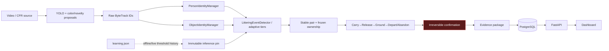
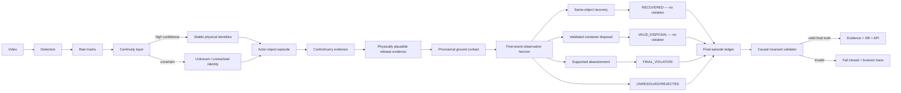
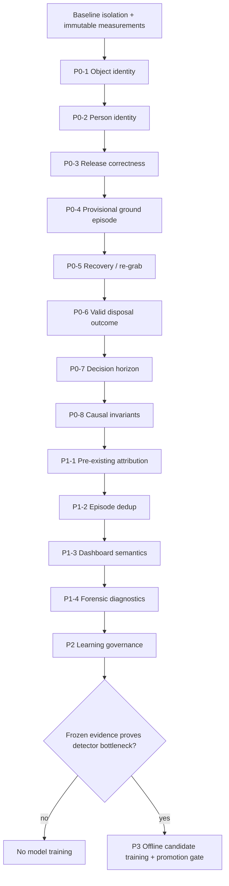

# MOTARED — Final Master Repair & Hardening Plan

## 0. Authority and execution boundary

This document is the mandatory plan before core implementation. It authorizes **planning only** until the baseline-isolation gate in Section 12 is satisfied. MOTARED is valuable and partially working; this is controlled hardening, not a rewrite.

Forbidden throughout:

- resetting/rebuilding the project;
- broad rewrites;
- blind threshold changes;
- model training before evidence proves a detector bottleneck;
- filename, timestamp, actor-ID, object-ID, color, FPS, or clip-specific branches;
- silent mutation/promotion of learning state;
- stacking a new repair on an unresolved regression;
- declaring readiness from tests alone.

## 1. Product truth

The product decides whether a person committed **illegal ground littering**. It must distinguish:

```text
TRUE VIOLATION:
control same object → carry → physically valid release → ground → no recovery/valid disposal → abandonment/departure → final violation

VALID DISPOSAL:
control same object → container interaction → same object deposited → final valid disposal → no violation

TEMPORARY CONTACT:
control same object → temporary ground → same-object recovery → continue handling / valid disposal → no violation

CARRY ONLY:
control same object → no abandonment → no violation

PRE-EXISTING LITTER:
object already grounded + passer-by → no attribution

MULTI-PERSON:
only causally linked handler/releaser can be accused
```

**Core invariant:** ground contact is intermediate evidence, not final truth.

## 2. Proven current failure

For job #51 / IMG_5616:

- recorded release f666/22.167s while real object remains carried;
- UID100004 transfers raw10030→raw10061 near f729;
- internal confirmation f734/24.433s precedes actual sampled ground placement;
- recovery begins around f910/30.333s;
- disposal occurs later around f1050–1060;
- confirmation is irreversible;
- no active bin relation or `VALID_DISPOSAL` state exists.

See `IMG_5616_ROOT_CAUSE_ANALYSIS.md` for full evidence. The three recent operator-declared non-violations—IMG_5611, IMG_5613, IMG_5616—were all reported as violations; this is a critical false-positive cluster requiring general repairs, not three clip patches.

## 3. Current architecture



### Current semantic weaknesses

1. Identity managers can over-reassociate.
2. Release can be inferred from unstable geometry/identity.
3. Ground/abandonment can confirm before future truth.
4. Re-grab ends at the departure lock point.
5. Valid disposal is only rejection logic.
6. Persisted diagnostics omit the exact decisive criterion.

## 4. Desired architecture



### Design principles

- Identity confidence is explicit and consumed by ownership/release/recovery.
- Unknown continuity never becomes a confident accusation.
- An episode has provisional and final outcomes.
- Finalization occurs only after semantic evidence or bounded unresolved handling.
- Valid disposal and recovered are first-class outcomes, not hidden error strings.
- Database/UI receive final semantic outcome plus diagnostics, not raw FSM guesses.

## 5. Generalized failure classes from latest validation experience

| Class | Evidence | General lesson |
|---|---|---|
| Cross-object stable-UID transfer | IMG_5616 | Reassociation must reject impossible/ambiguous continuity |
| Person identity split | IMG_5616 | Guilt cannot be frozen to a stale identity while same actor continues under new UID |
| False early release | IMG_5616 | Release requires same-physical-object control loss, not anomalous distance/track behavior |
| Temporary ground + recovery | IMG_5616 | Ground is provisional; recovery changes final truth |
| Valid disposal mistaken for violation | IMG_5611 and IMG_5616 operator truth | Container semantics require temporal object linkage and final outcome |
| Pre-existing/proximity attribution | IMG_5613 and IMG_5301 forensic review | Old ground objects cannot acquire ownership from proximity |
| Timestamp inconsistency | job #47 and job #51 records/physical truth | Enforce causal chronology before persistence |
| Multi-person selective ownership | IMG_5118 frozen positive | Repairs must not lose correct actor attribution |
| Duplicate/tier lifecycle | adaptive tier design and long clips | One physical episode must yield one final event |
| Learning-induced sensitivity | pinned overrides derived from historical rejections | Threshold adaptation is not semantic learning and must remain gated/offline |

## 6. Exact repair order and dependency graph



Do not reorder P0-4/5/6 ahead of identity and release: recovery/disposal semantics are unsafe if “same object” is unreliable.

## 7. Repair groups

### P0-1 — Object physical identity continuity

**Problem:** stable UID can jump to another physical object.  
**Preserve:** true short-gap ID churn continuity; distinct-object separation; class-family constraints; stable ownership.  
**Design work before code:** define a continuity score/decision with hard impossibility gates: simultaneous existence, displacement relative to elapsed frames/frame size, IoU/predicted motion, scale/aspect change, source/class family, age, edge exit/re-entry, and reservation. Return match confidence/reason; uncertain means new/unknown UID.  
**Likely files:** `inference/tracking/object_identity.py`, `littering_event_detector.py`, tests only.  
**RED tests:** reproduce raw10030→different-static-raw10061 theft; crossing similar objects; impossible jump; scale discontinuity; true short occlusion.  
**Acceptance:** zero UID theft on annotated scenarios; no regression on true churn tests; IMG_5616 handled-object trajectory is not transferred to static clutter.

### P0-2 — Person identity continuity

**Problem:** same actor splits across P12/P71/P80 UIDs.  
**Preserve:** no same-frame UID sharing; no position-swap merge; long-gap uncertainty.  
**Design:** conservative re-entry hypothesis using track history, velocity/edge topology, body geometry, optional appearance descriptor only after privacy/performance review; expose confidence. Never merge merely because only one person exists.  
**Files:** `inference/tracking/person_identity.py`, detector bridge/tests.  
**RED tests:** edge exit/re-entry same actor; two similar actors; crossing; occlusion; long-gap split.  
**Acceptance:** correct continuity on IMG_5616 without false-merging multi-person set.

### P0-3 — Physically plausible release

**Problem:** release f666 precedes real release by ~2.833s.  
**Preserve:** fast real drops and throws; AIDM true separation; short positives.  
**Design:** release evidence must be conditioned on high-confidence same-object continuity. Require a coherent multi-tick combination of control-loss, wrist/object separation reliability, relative motion, object trajectory, and post-control evidence. Identity discontinuity yields “occluded/unknown,” not release. Every release records criterion and measurements.  
**Files:** `littering_event_detector.py`, pose/identity data interfaces, tests.  
**Acceptance:** IMG_5616 cannot release while object visibly carried; frozen positive timing remains within protocol tolerance.

### P0-4 — Ground as provisional state

**Problem:** `BAG_ON_GROUND` quickly becomes accusation.  
**Preserve:** ability to detect genuine grounded litter and stationary abandonment.  
**Design:** introduce episode-level provisional ground representation without immediately changing external confirmed-event contract. Ground evidence includes physical object identity, contact confidence, stationary evidence, source criterion, and uncertainty.  
**Files:** FSM/event model and serialization tests; migration/API only after internal contract proves stable.  
**Acceptance:** temporary ground does not emit final violation before resolution; true ground litter remains candidate.

### P0-5 — Recovery / re-grab continuity

**Problem:** recovery after departure/confirmation is ignored.  
**Preserve:** tracker bounce must not cancel real litter; wrong object/person must not cancel.  
**Design:** recovery is a high-confidence same-object episode transition. It can resolve a provisional candidate; the event is not persisted as final beforehand. Other-person pickup is a separate outcome requiring policy, not automatic cancellation.  
**Acceptance:** IMG_5616 becomes recovered/provisional before bin outcome; wrong-object and bounce tests remain violations/unresolved as appropriate.

### P0-6 — Valid disposal first-class outcome

**Problem:** no semantic `VALID_DISPOSAL`; bin is only rejection.  
**Preserve:** true litter beside dumpsters (IMG_5290/5306) must still confirm.  
**Design options evaluated in a spike/read-only benchmark before production code:

1. operator zones for static cameras;
2. container detector/classifier;
3. object trajectory to opening/zone;
4. hand/object/container proximity;
5. disappearance at container with no ground rest;
6. recovery→container movement→post-action absence;
7. aftermath consistency.

Require multiple signals and permit `UNRESOLVED`. Do not treat “near dumpster” as disposal.  
**Likely files:** new isolated semantic component preferred; detector/FSM integration; schemas/API/UI later.  
**Acceptance:** IMG_5611, IMG_5616, IMG_5305 no violation; IMG_5290 and true ground portion of IMG_5306 preserved.

### P0-7 — Final decision horizon

**Problem:** confirmation before later recovery/disposal.  
**Design:** candidate→observation→finalizer. Derive horizon from signed event intervals, plot accuracy/latency curve, choose policy by owner-approved risk target. Live and finite-file end policies differ explicitly; end-of-clip uncertainty fails closed.  
**Acceptance:** all validated recoveries/disposals resolve before final accusation; true-litter latency reported and accepted.

### P0-8 — Causal invariants

**Problem:** stored timestamps can violate chronology.  
**Hard validator:** `carry ≤ release ≤ ground ≤ final`, plus recovery/disposal constraints. Invalid events cannot be persisted/displayed as confirmed; emit forensic failure.  
**Files:** event construction, pipeline persistence boundary, schemas/tests.  
**Acceptance:** zero violations across full suite; deliberately malformed unit cases fail closed.

### P1-1 — Pre-existing litter attribution

Require proven control/origin before ownership. Ground-first static objects remain scene context unless the person demonstrably picks them up and a later same-object release occurs. Validate IMG_5613/5301 after operator interval labeling.

### P1-2 — Episode dedup

Introduce stable episode identity from actor hypothesis + physical object hypothesis + temporal/spatial continuity. Tier events and raw-ID churn merge only when episode continuity is proven. Distinct objects/actors never merge.

### P1-3 — Dashboard semantic correctness

Only after backend outcome contract stabilizes: default list final violations only; diagnostics expose candidates/rejected/recovered/valid disposal. Artifact availability controls verification language. Historical rows marked legacy when final semantics cannot be reconstructed.

### P1-4 — Forensic diagnostics

Persist compact decisive traces: identity match reason/confidence, release criterion, ground criterion, recovery/disposal signals, active thresholds/pin hash, causal validation, and frame references. Avoid full sensitive trajectory dumps unless diagnostics explicitly enabled.

### P2 — Learning hardening

Keep deterministic production on immutable pin. Replace automatic truth assumptions with operator-validated versioned experience. Candidate config/policy/model must pass frozen gate. Add concurrent-write safety, immutable snapshots, provenance, parent version, rollback pointer, and anomaly/poisoning checks. Confirmations/pseudo-labels never self-promote.

### P3 — Conditional model training

Only if first-failed-stage metrics after P0/P1 show detector recall/classification is limiting. Use `learning_offline`; replay; source-grouped splits; frozen holdout; candidate weights; explicit gate; archived rollback. Never train to compensate for FSM/identity errors.

## 8. Files and module impact map

| Repair | Primary modules | Secondary contracts | Must not touch yet |
|---|---|---|---|
| P0-1 | `object_identity.py`, detector integration | identity telemetry/tests | dashboard, DB, models |
| P0-2 | `person_identity.py`, detector integration | ownership/evidence tests | dashboard, model weights |
| P0-3 | `littering_event_detector.py` | pose/identity evidence | global thresholds |
| P0-4/5/7 | FSM/episode lifecycle | pipeline event/evidence buffer | DB/UI until internal contract green |
| P0-6 | isolated disposal semantic component + FSM bridge | optional detection/zones | model training without proof |
| P0-8 | event validator + persistence guard | schemas/report/UI diagnostics | historical data rewrite |
| P1-1/2 | ownership + episode identity | evidence dedup | filename rules |
| P1-3 | backend schemas/API/dashboard | migration plan if needed | inference semantics |
| P1-4 | trace schema/report/evidence | retention/privacy settings | thresholds |
| P2 | adaptive/pin/offline governance | CI/promotion artifacts | automatic promotion |
| P3 | offline detector training | weights + gate | production weights before pass |

## 9. Tests required per repair

The authoritative matrix is `FINAL_VALIDATION_PROTOCOL.md`. Minimum new test files should be organized by behavior, not clip name:

- `test_object_physical_continuity.py`
- `test_person_reentry_identity.py`
- `test_release_physical_plausibility.py`
- `test_episode_final_semantics.py`
- `test_valid_disposal_semantics.py`
- `test_event_causal_invariants.py`
- `test_preexisting_litter_ownership.py`
- `test_episode_dedup.py`
- API/dashboard lifecycle tests

Existing tests must be preserved and extended rather than bypassed: `test_layer2_identity.py`, `test_littering_event_detector.py`, `test_pipeline_integration.py`, `test_bin_zone.py`, `test_acceptance_multiperson.py`, `test_stable_ownership_regression.py`, `test_frozen_eval_*`, evidence/API/dashboard tests.

## 10. Real-video validation matrix

| Repair | Must-fix clips | Must-not-regress clips |
|---|---|---|
| P0-1/2 | IMG_5616 | IMG_5118 multiperson, distinct-person/object synthetic set |
| P0-3 | IMG_5616 | IMG_5117, IMG_5290, IMG_5295 true releases |
| P0-4/5/7 | IMG_5616 | IMG_5117/5290/5295 true abandonment; IMG_5115 carry-only |
| P0-6 | IMG_5611, IMG_5616, IMG_5305 | IMG_5290 and true litter in IMG_5306 |
| P0-8 | jobs #47/#51 + all manifests | all valid events preserve timestamps |
| P1-1 | IMG_5613, IMG_5301 after operator labels | true pickup→litter positives |
| P1-2 | long/tier/churn cases | simultaneous distinct incidents |
| P1-3/4 | all selected jobs | historical-row compatibility |
| P2/P3 | full frozen suite | all hard negatives and positives |

Run sequentially on constrained CPU; parallel full-resolution ffmpeg/evaluation previously caused memory failure.

## 11. Risk assessment

| Risk | Severity | Control |
|---|---|---|
| UID false merge hides or misattributes event | Critical | conservative uncertainty, annotated merge/split metrics |
| Longer horizon causes unacceptable alert delay | High | empirical latency curve, owner-approved target |
| Valid-disposal logic suppresses near-bin litter | Critical | IMG_5290/5306 hard positive gates |
| FSM rewrite regresses working positives | Critical | vertical slices, compatibility layer, no broad rewrite |
| Dirty tree mixes old/new changes | Critical | baseline isolation before any implementation |
| Schema/UI change breaks historical jobs | High | versioned outcome schema and legacy display path |
| Telemetry leaks sensitive trajectories/faces | High | compact diagnostics, retention/access controls |
| Learning label poison | Critical | human validation, provenance, frozen promotion gate |
| Detector training masks logic defect | High | first-failed-stage proof required |
| Test-only success gives false confidence | Critical | mandatory real/frozen/repro gates |

## 12. Checkpoint and rollback strategy

### Immediate blocker

Observed branch `main`, HEAD `712133fd6f9a52edf5292701d61947e32a5b9ea2`, with many tracked and untracked changes. Creating a checkpoint now would mix unrelated work; destructive cleanup is forbidden.

### Safe baseline procedure

1. Export `git status`, tracked diff, untracked inventory, environment, DB schema, pin/config/model hashes.
2. Owner classifies existing tracked changes.
3. Create dedicated repair branch/worktree from owner-approved baseline.
4. Carry only approved baseline changes explicitly.
5. Run baseline focused tests and full frozen suite; store artifacts.
6. Tag checkpoint `pre-p0-1-<candidate>` or record immutable commit SHA.

### Per-group rollback

- One repair group per commit.
- No threshold/model/pin artifact bundled with logic code unless that group explicitly owns it.
- If any stop gate fails, halt; revert only the current repair commit in the repair worktree or reset that isolated worktree to its prior checkpoint.
- Preserve failed candidate reports for diagnosis.
- Never “fix forward” by adding a second unrelated patch.

### Data safety

- Validation uses copied/read-only videos.
- Database writes go to isolated validation DB/schema.
- Evidence output uses candidate-specific directory.
- Production pin and weights are read-only until explicit promotion.

## 13. Execution protocol after planning approval

For each group:

1. Deep-read primary module and callers.
2. Record current behavior and preserved invariants in `CHANGE_LEDGER.md`.
3. Create checkpoint.
4. Write one failing behavior test; run RED.
5. Implement minimal vertical slice; run GREEN.
6. Run focused regressions.
7. Run targeted real videos and compare before/after.
8. Run full frozen suite.
9. Run 3× reproducibility.
10. Review evidence and risks.
11. GO, correct current group, or rollback. Only GO permits next group.

## 14. Mandatory pre-implementation outputs — completion map

| Required output | Location/status |
|---|---|
| A Complete root-cause matrix | `ROOT_CAUSE_MATRIX.md` |
| B Current architecture diagram | Section 3 |
| C Desired architecture diagram | Section 4 |
| D IMG_5616 problem flowchart | `IMG_5616_ROOT_CAUSE_ANALYSIS.md` |
| E Latest-video generalized classes | Section 5 |
| F Exact repair order | Section 6 |
| G Files/modules affected | Section 8 |
| H Tests per repair | Sections 7/9 + validation protocol |
| I Real-video matrix | Section 10 |
| J Rollback strategy | Section 12 |
| K Risk assessment | Section 11 |

## 15. Success definition

MOTARED is functionally ready only after measured evidence demonstrates:

- true litter remains detected;
- valid disposal and temporary ground/recovery are not accused;
- pre-existing litter is not attributed to passers-by;
- stable identities correspond to physical identities;
- one physical incident yields one final event;
- timestamps are causally valid;
- evidence is truthful and complete;
- repeated runs are reproducible;
- production behavior changes only through explicit immutable promotion;
- every P0 class is tested on synthetic and real video;
- owner-approved P/R/F1/FPR and latency gates pass.

No production-readiness claim is made by this plan.
