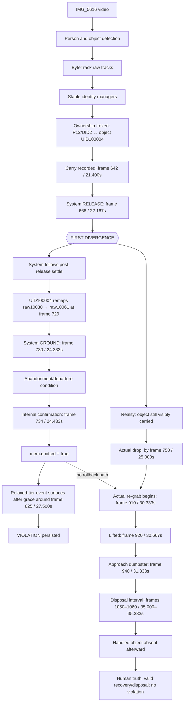
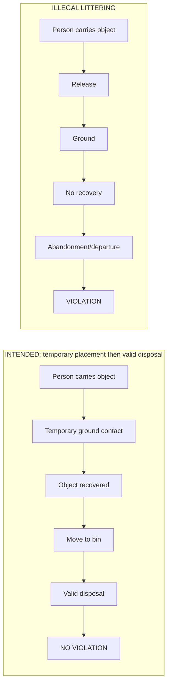
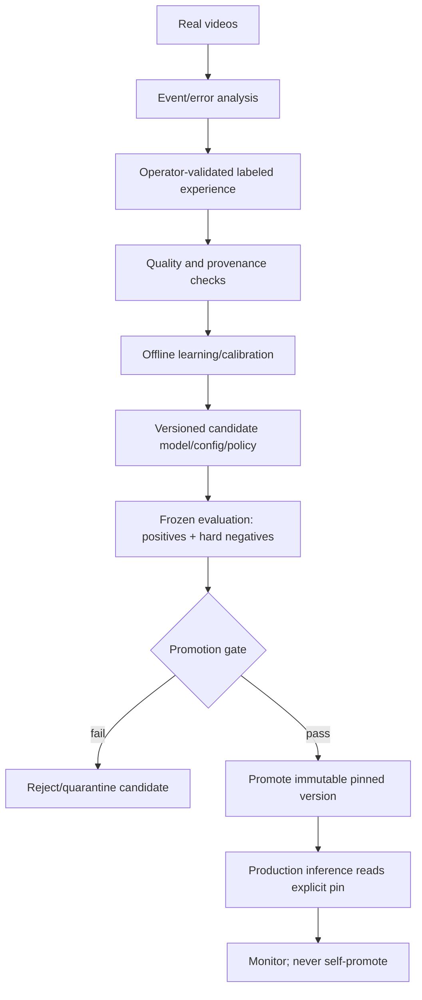

# IMG_5616.MOV / Analysis Job #51 — Root-Cause and Learning Analysis

**Mode:** analysis only. No inference source, configuration, model, threshold, FSM, bin logic, database, or dashboard behavior was changed.

## Evidence labels

- **PROVEN BY CODE** — established directly from current source.
- **PROVEN BY RUNTIME** — established from job #51 database rows, manifest, metadata, or `frames.jsonl`.
- **PROVEN BY REAL VIDEO** — visible in actual frames extracted from `source_CFR.mp4`.
- **INFERRED** — best explanation connecting proven observations; not directly logged.
- **NOT VERIFIED** — required data was not recorded or could not be established without rerunning/instrumenting inference.

---

## 1. Executive Summary

### Direct answer

MOTARED classified IMG_5616 as a violation because its relaxed tier-1 temporal detector constructed a false early sequence:

`CARRY (642) → RELEASE (666) → GROUND (730) → CONFIRMED (734)`.

The first divergence from physical reality was **frame 666 / 22.167 s**. The stored event says the object was released, but the real frame sequence shows the black-shirt actor still carrying the small white object through approximately frame 745; the first sampled frame showing it absent from the hand/on the ground is frame 750 / 25.000 s. **PROVEN BY RUNTIME + PROVEN BY REAL VIDEO.**

A second, compounding divergence occurred at frame 729–730: stable object UID `100004` moved from raw track `10030` (the actor-associated moving detection) to raw track `10061` (a different, visually static detection around the dumpster). The FSM therefore treated a remapped/static detection as the same handled object and accumulated stationarity/ground/abandonment evidence. **PROVEN BY RUNTIME; physical-object equivalence is disproven by the bbox discontinuity and real frames.**

The detector internally confirmed at **frame 734 / 24.433 s**, about **0.567 s before the first sampled physical drop/ground frame at 25.000 s**, **5.900 s before visible re-grab begins at frame 910 / 30.333 s**, and **10.567–10.900 s before the visible disposal interval/aftermath around frames 1050–1060 / 35.000–35.333 s**. The relaxed event was surfaced after its 3-second grace period; `frames.jsonl` first carries it at frame 825 / 27.500 s. **PROVEN BY RUNTIME + PROVEN BY CODE.**

MOTARED did not cancel the event because:

1. `VIOLATION_CONFIRMED` sets `mem.emitted=True`; `_evaluate_confirmation()` then refuses further evaluation for that pair.
2. Re-grab is only accepted while the pair is in `BAG_RELEASED` or `BAG_ON_GROUND`; `PERSON_DEPARTED` explicitly does not reclaim.
3. There is no positive `VALID_DISPOSAL` terminal state. Bin handling is only a pre-confirmation rejection (`BIN_DISPOSAL` or `BIN_ZONE_DEPOSIT`).
4. No bin zone was configured for this run, and no bin/container relation was recorded in `frames.jsonl`.
5. By the later recovery, the physical actor had changed from event identity `P12/person UID 2` to raw IDs `P71`, then `P80/person UID 4`; the actual handled object was no longer represented by the event pair. **PROVEN BY CODE + PROVEN BY RUNTIME.**

### Root-cause classification

**Primary:** **F. Tracking failure + G. Identity failure**, causing premature false release and object substitution.  
**Architectural amplifiers:** **B. Premature confirmation, A. Missing VALID_DISPOSAL semantic state, I. Re-grab failure, J. Too-short temporal horizon, K. Event finalization too early.**  
**Contributing condition:** **E. Missing bin zone.**  
**Not the primary cause:** a simple “ground threshold too low.” The recorded bbox nearest the ground transition is not geometrically on the actor’s ground plane; the stronger evidence is identity substitution plus relaxed-tier temporal inference.

**Confidence:** high for the false release, identity discontinuity, early irreversible confirmation, absent bin-zone evidence, and missed later recovery; medium for the exact internal sub-criterion that incremented `ground_evidence_frames`, because pair-memory details were compacted out of persisted event records.

---

## 2. Human Semantic Ground Truth

The real sequence is:

1. Actor handles/carries a small white object.
2. Object is temporarily placed/dropped on the road.
3. The actor returns and re-grabs it.
4. The actor moves it to the dumpster.
5. The object is no longer visible in the hand or on the road after the disposal interval.

Under the intended MOTARED semantics this is **NO VIOLATION: temporary ground contact followed by recovery and valid disposal**. The pickup/disposal details are **PROVEN BY REAL VIDEO** at the sampled-frame resolution. The exact instant the object crosses the dumpster lip is partly occluded; disposal is **INFERRED with high confidence** from the continuous action and post-action absence, not directly visible as an unobstructed object-in-bin frame.

---

## 3. Actual System Interpretation

Job #51 produced one persisted event:

| Field | Recorded value | Evidence |
|---|---:|---|
| Event DB ID | 23 | **PROVEN BY RUNTIME** |
| Runtime event ID | `bb319abf4739` | **PROVEN BY RUNTIME** |
| Person raw/stable | `12` / UID `2` | **PROVEN BY RUNTIME** |
| Object raw/stable | `10030` / UID `100004` | **PROVEN BY RUNTIME** |
| State | `VIOLATION_CONFIRMED` | **PROVEN BY RUNTIME** |
| Adaptive tier | 1 | **PROVEN BY RUNTIME** (`evidence.adaptive_tier`) |
| Confidence | 0.8971 | **PROVEN BY RUNTIME** |
| Carry score | 0.75 | **PROVEN BY RUNTIME** |
| Release/stationary/departure scores | 1.0 / 1.0 / 1.0 | **PROVEN BY RUNTIME** |
| Association score | 0.5962 | **PROVEN BY RUNTIME** |
| Carry/release/ground/confirmed | 642 / 666 / 730 / 734 | **PROVEN BY RUNTIME** |
| Recorded departure | 754 | **PROVEN BY RUNTIME** |

The primary strict tier recorded zero candidates/confirmations, while adaptive tier 1 and tier 2 each recorded one confirmation. The accepted event identifies adaptive tier 1. **PROVEN BY RUNTIME.**

---

## 4. First Divergence

### First semantic divergence: frame 666 / 22.167 s

| Reality | System |
|---|---|
| Actor still visibly carries the small white object; sequence retains it in hand through about frame 745. | Event records `release=666` and `release_score=1.0`. |

This is earlier than the ground and bin questions. The system began reasoning about a released object approximately **2.833 s before** the first sampled frame showing the object absent from the hand/on the ground at frame 750. **PROVEN BY RUNTIME + PROVEN BY REAL VIDEO.**

### First identity substitution: frame 729 / 24.300 s

- Frame 725: raw object `10030` has stable UID `100004`.
- Frame 729: raw `10030` has no stable UID, while raw `10061` receives UID `100004`.
- Frame 733: raw `10030` remains present without stable UID; `10061` temporarily maps to UID `100002`.
- Frame 737 onward: `10061` again carries UID `100004` and remains almost motionless around bbox `[530,682,661,887]` for the rest of the video.

This is object-identity churn/substitution, not continuity of one tracked physical bbox. **PROVEN BY RUNTIME.**

---

## 5. Full Event Timeline

`frames.jsonl` stores analysis ticks at roughly 8 fps (mostly every four source frames), so not every source frame has a full serialized detection record. Bboxes below use the nearest persisted analysis tick; values not persisted are labeled accordingly.

| Frame | Time | Real action | Person detection | Object detection / identity | Ownership | FSM/system state | Ground relation | Bin relation | System interpretation |
|---:|---:|---|---|---|---|---|---|---|---|
| 540/541 | 18.000/18.033 | Initial object interaction/pickup | Later event actor is P12/UID2 | Object identity not yet event-frozen | Not frozen | `BAG_NEAR_PERSON` appears by 541 | Object initially near roadway | No structured bin relation | Candidate proximity |
| 629 | 20.967 | Carrying | P12 | raw10030/UID100004, bbox `[263.2,524.2,439.5,752.4]` | Pair developing | Near/no-bag mixed state | Not established | None | Near person |
| 642 | 21.400 | Carrying | P12/UID2 frozen event actor | raw10030/UID100004 | Ownership frozen at carry | `BAG_CARRIED` in event record | Off-ground carry | None | Carry established |
| **666** | **22.167** | **Still carrying** | P12 | raw10030/UID100004 nearest tick 665 | Frozen P12↔UID100004 | **`BAG_RELEASED`** | Release pose does not visibly show true drop | None | **FIRST DIVERGENCE** |
| 725 | 24.167 | Still carrying; actor passing close camera | P12 | raw10030/UID100004 bbox `[741.2,699.2,1045.9,1129.0]` | Frozen pair | Release path active | Not verified as ground | None | Post-release settle accumulating |
| 729/730 | 24.300/24.333 | Still carrying/occluded near edge | P12 | UID100004 jumps raw10030→raw10061 | Frozen event object UID now bound to different raw detection | `BAG_ON_GROUND` recorded at 730 | System claims ground; nearest recorded geometry contradicts ordinary near-ground test | No active zone | Ground/abandonment begins |
| **734** | **24.433** | **Actor/object still in carry/occlusion interval; physical drop not yet visible** | P12 | identity already unstable | Frozen pair | **`VIOLATION_CONFIRMED`** | stationary score=1.0 | no bin evidence | **Irreversible internal confirmation** |
| 750 | 25.000 | First sampled frame showing actual temporary drop/ground contact | P12 track is ending; P71 appears in this period | system UID100004 remains on static raw10061 | Event already frozen/emitted internally | Confirmed | Real ground contact now occurs | Dumpster visible, not encoded | Reality finally reaches temporary ground state—after confirmation |
| 754 | 25.133 | Actor momentarily out of view | no P12 at nearest tick 753 | raw10061/UID100004 static | No valid actor-object pair | departure recorded | Static proxy remains | None | Departure asserted |
| 825 | 27.500 | Object remains temporary on ground | no matching event actor | raw10061/UID100004 static | None | event first appears in serialized frame after relaxed grace | Ground object visible | Dumpster visible only as pixels | Violation surfaced |
| 910 | 30.333 | Re-grab begins | P80/UID4, not P12/UID2 | physical object not matched to event; raw10061/UID100004 remains static elsewhere | No event-pair ownership | already confirmed | temporary contact ends physically | no relation | Recovery missed |
| 920 | 30.667 | Object visibly lifted | P80/UID4 | event UID still on static raw10061 | No re-grab for event pair | already confirmed | no longer on ground physically | none | Recovery missed |
| 940 | 31.333 | Actor carries object toward dumpster | P80/UID4 | no matching handled-object association | None | already confirmed | — | pixels show approach, no zone | No valid-disposal representation |
| 1050 | 35.000 | Last clear handled-object/disposal-interval view | P80/UID4 | raw10061/UID100004 still static proxy | None | already confirmed | — | physical dumpster interaction | Ignored for event truth |
| 1060 | 35.333 | Handled object absent after disposal interval | P80/UID4 | raw10061/UID100004 still detected at static bbox | None | already confirmed | — | no structured bin signal | Violation remains |
| 1157 | 38.567 | Final aftermath; actor remains near dumpster, handled object absent | P80 | raw10061/UID100004 still static | None | confirmed event retained | — | no zone / no valid-disposal state | Final result remains violation |

---

## 6. FSM Trace

### Intended semantic distinction

**PROVEN BY CODE:** the implemented FSM has states `NO_BAG`, `BAG_NEAR_PERSON`, `BAG_CARRIED`, `BAG_RELEASED`, `BAG_ON_GROUND`, `PERSON_DEPARTED`, `PICKED_BACK_UP`, `VIOLATION_CONFIRMED`; it has no `VALID_DISPOSAL` state (`littering_event_detector.py:51-59`).

---

## 7. Ground Contact Analysis

### What caused `BAG_ON_GROUND`

The code moves `BAG_RELEASED → BAG_ON_GROUND` when either:

- `stationary_frames >= min_stationary_frames`, or
- an always-progressing post-release settle streak reaches half that threshold, accelerated when the object is stationary or “left behind” (`littering_event_detector.py:2296-2374`).

Tier 1 reduces `min_stationary_frames` to 6 and `min_abandonment_frames` to 5 (`adaptive_tuner.py:81-97`). Job #51’s accepted event is tier 1. **PROVEN BY CODE + RUNTIME.**

### Nearest persisted geometry to the ground decision

The exact transition is recorded at frame 730, but the nearest full serialized record is frame 729 / 24.300 s:

| Quantity | Value | Evidence |
|---|---:|---|
| Person bbox | `[647.2463, 245.4302, 1080.0, 1902.5581]` | **PROVEN BY RUNTIME** |
| raw10030 bbox | `[791.8082, 719.6010, 1080.0, 1147.5070]` | **PROVEN BY RUNTIME** |
| Object center | `(935.9041, 933.5540)` | calculated from runtime bbox |
| Object bottom | `1147.5070` | **PROVEN BY RUNTIME** |
| Person height | `1657.1279` | calculated |
| Person feet y | `1902.5581` | runtime bbox bottom |
| Config ground margin | `0.40 × person height` | **PROVEN BY CODE/config** |
| Near-ground threshold y | `1239.7069` | calculated |
| Object center vs threshold | `306.153 px above threshold` | calculated |
| Object confidence | `0.6863` | **PROVEN BY RUNTIME** |
| Stationary score | `1.0` | event evidence, **PROVEN BY RUNTIME** |
| Ground-evidence frame count | not retained in compact event | **NOT VERIFIED** |
| Object motion at transition | raw10030 bbox moves materially; raw10061 is static afterward | **PROVEN BY RUNTIME** |

This geometry does **not** satisfy the ordinary live `near_ground_plane` center test for raw10030 at the nearest tick. Therefore the exact internal ground-evidence route was likely release-pose fallback, loose settle evidence, AIDM synthetic evidence, or evidence from the remapped raw track; the persisted compact event does not retain enough pair details to distinguish them. **INFERRED; exact route NOT VERIFIED.**

### Was this abandonment?

No. The full real-video sequence shows later recovery and disposal. The ground contact was temporary. **PROVEN BY REAL VIDEO.**

---

## 8. Bin / Valid Disposal Analysis

| Question | Finding |
|---|---|
| Was a bin/container visible? | Yes, a large dumpster dominates the scene. **PROVEN BY REAL VIDEO.** |
| Was a bin/container detected as a semantic entity? | No bin/container detections or relations appear in `frames.jsonl`. **PROVEN BY RUNTIME.** |
| Did a bin zone exist/activate? | `events.yaml` contains only commented examples; job telemetry has no bin-zone relation. `bin_zone_frames` is not persisted in the compact event. Active zone evidence is absent. **PROVEN BY CODE/config + RUNTIME.** |
| Did the physical object enter/move toward the bin? | It was recovered, carried toward the dumpster, and absent after the disposal interval. **PROVEN/INFERRED BY REAL VIDEO.** |
| Did it disappear behind/inside the container? | The exact crossing is occluded; it becomes absent after the interaction. **INFERRED with high confidence.** |
| Did it reappear? | Not in the remaining clip. **PROVEN BY REAL VIDEO at sampled resolution.** |
| Did the system detect recovery? | No. The event remained confirmed; no event-pair re-grab was recorded. **PROVEN BY RUNTIME.** |
| Did the system detect valid disposal? | No valid-disposal event/state/rejection was recorded. **PROVEN BY RUNTIME.** |
| Can the FSM represent valid disposal? | Only as pre-confirmation rejection reasons `BIN_DISPOSAL`/`BIN_ZONE_DEPOSIT`; no positive valid-disposal state and no post-confirmation cancellation. **PROVEN BY CODE.** |

### Did the system have enough information?

- **Pixels:** yes. The full video contains the recovery, movement to the dumpster, interaction, and aftermath. **PROVEN BY REAL VIDEO.**
- **Structured inference state:** no. The event’s physical actor had become P80/UID4 rather than P12/UID2; the handled object was not represented by the frozen event object, while UID100004 remained attached to static raw10061; no bin zone/container relation existed. **PROVEN BY RUNTIME.**
- **Architecture:** even if later pixels could have been interpreted, the confirmed event was already emitted and had no rollback/final-truth stage. **PROVEN BY CODE.**

---

## 9. Tracking / Identity Analysis

### Person identity

- Event actor: raw P12, stable person UID2.
- P12’s last recorded stable mapping frame: 742.
- Raw P71 appears around frame 740 and receives a different stable identity.
- Raw P80 appears from about frame 855 and is stable UID4; it is the actor visible during recovery/disposal.

Thus the same visually continuous black-shirt actor was fragmented across system identities around the critical period. **PROVEN BY RUNTIME for ID changes; same physical actor PROVEN BY REAL VIDEO.**

### Object identity

- raw10030/UID100004 follows the actor until frame 725.
- At frame 729 UID100004 is assigned to raw10061; raw10030 has no stable UID.
- raw10061 remains almost perfectly static at approximately `[535,678,658,887]` through the end.
- During visible recovery/disposal the system continues to report raw10061/UID100004 at that static location, proving the stable object identity does not follow the physically handled item.

**Conclusion:** the physical object was effectively replaced by a different system object while retaining its stable UID. The later real recovery could not be recognized as a re-grab of the event object. **PROVEN BY RUNTIME + REAL VIDEO.**

---

## 10. Confirmation Timing and Irreversibility

| Milestone | Frame/time |
|---|---:|
| Recorded false release | 666 / 22.167 s |
| Recorded ground | 730 / 24.333 s |
| Internal confirmation | 734 / 24.433 s |
| Actual sampled drop/ground | 750 / 25.000 s |
| Relaxed event visible in `frames.jsonl` | 825 / 27.500 s |
| Visible recovery starts | 910 / 30.333 s |
| Visible object lifted | 920 / 30.667 s |
| Disposal interval | 1050–1060 / 35.000–35.333 s |

Temporal gaps from internal confirmation:

- to recovery start: **5.900 s**;
- to lifted object: **6.233 s**;
- to disposal interval start: **10.567 s**;
- to post-disposal absence: **10.900 s**.

`_evaluate_confirmation()` returns immediately when `mem.emitted` is true; confirmation sets `VIOLATION_CONFIRMED`, `confirmed_frame/ts`, and `emitted=True` (`littering_event_detector.py:2991-3003`). Re-grab transitions exist only from `BAG_RELEASED` and `BAG_ON_GROUND` (`2296-2314`, `2376-2394`); `PERSON_DEPARTED` explicitly calls confirmation and does not reclaim (`2422-2428`). **PROVEN BY CODE.**

Therefore current architecture is not capable of reversing a confirmed event when later evidence proves recovery/disposal. **PROVEN BY CODE.**

---

## 11. Root Cause

### Causal chain

1. Relaxed tier accepts a false release while the item is still carried.
2. Person/object raw tracking destabilizes near the frame edge.
3. Stable object UID transfers to a static dumpster-area detection.
4. Post-release settle/stationarity logic interprets the static proxy as the released object.
5. Tier-1’s shorter horizon reaches abandonment and confirms.
6. Confirmation becomes irreversible.
7. Later re-grab occurs under a different person UID and with no matching moving object UID.
8. No active bin zone and no valid-disposal state exist to represent final truth.

### Classification

| Category | Verdict | Evidence |
|---|---|---|
| A Missing VALID_DISPOSAL state | **Major architectural amplifier** | Code has only bin rejection reasons, no state. |
| B Premature confirmation | **Major** | confirmed before physical drop and 5.9 s before recovery. |
| C Ground heuristic | **Contributing but not primary** | ordinary geometry at nearest tick is not ground; exact internal route unpersisted. |
| D Bin detection/classification | **Contributing** | no bin entity in runtime records. |
| E Missing bin zone | **Contributing** | config examples commented; no runtime relation. |
| F Tracking failure | **Primary** | raw person/object discontinuities. |
| G Identity failure | **Primary** | UID100004 transferred to static raw10061; physical actor becomes another UID. |
| H Ownership failure | **Downstream consequence** | frozen ownership could not follow physical actor/object after fragmentation. |
| I Re-grab failure | **Major amplifier** | recovery occurred but was not tied to event pair. |
| J Too-short temporal horizon | **Major** | tier-1 abandonment confirms before 5.9 s recovery. |
| K Event finalization too early | **Major** | irreversible at frame 734. |
| L Dedup/event lifecycle | **Contributing** | lifecycle has emit/grace but no cancellation/final semantic reconciliation. |

---

## 12. Last Five Distinct Recent Real Videos

Selection: most recent **distinct** completed real-video jobs at and around job #51, skipping duplicate job #48 (same `IMG_5613.MOV` as job #50). Selected: #52, #51, #50, #49, #47. Database ordering/status and event timestamps are **PROVEN BY RUNTIME**. Expected semantics for IMG_5118 come from the frozen operator-validated set; other expected semantics are real-video forensic classifications and are marked accordingly.

| Video / job | Expected | Actual | TP/TN/FP/FN | Important evidence | Root cause / lesson |
|---|---|---|---|---|---|
| IMG_5118 / #52 | LITTER (**frozen label**) | 1 event, confirmed 5.900 s | **TP** | Frozen test set calls it multiperson selective littering; one actor/object event persisted. | Multi-person ownership must accuse only the handler. **Ownership/evidence lesson.** |
| IMG_5616 / #51 | NO VIOLATION (**real video**) | 1 event, confirmed 24.433 s | **FP** | false release at 22.167 s; UID substitution at 24.3 s; recovery 30.333 s; disposal 35.0–35.333 s. | Temporary ground contact/recovery/disposal requires final semantic reconciliation. |
| IMG_5613 / #50 | NO ATTRIBUTABLE EVENT (**real-video review, medium confidence**) | 1 event, confirmed 21.100 s | **FP** | Overview shows pre-existing ground clutter and no clear actor-linked release; system confirms a short event. | Pre-existing litter/static clutter must not inherit ownership from proximity. |
| IMG_5611 / #49 | VALID DISPOSAL (**real-video review, high confidence**) | 1 event, confirmed 40.433 s | **FP** | Actor carries a bag to dumpster and leaves empty-handed; no ground abandonment is established visually. | Bin interaction must be temporally tied to the handled object before accusation. |
| IMG_5301 / #47 | NO ATTRIBUTABLE EVENT (**real-video review, high confidence**) | 1 event; manifest reports inconsistent confirmed 24.167 s before release 24.567 s | **FP** | Actor walks past pre-existing trash/dumpster without attributable discard in event window. | Confirmation timestamp ordering and pre-existing-object ownership require hard invariants. |

**Caution:** IMG_5611/IMG_5613/IMG_5301 are not present as operator labels in `frozen_test_set.v1.json`; classifications above are frame-based forensic judgments, not pre-existing labels. They should be validated by an operator before entering any learning dataset.

### Cross-video structural pattern

The weakness is not local to IMG_5616:

- #47 and #50 show proximity/pre-existing-clutter attribution risk.
- #49 and #51 show bin/final-disposal semantics not preventing a violation.
- #47 and #51 manifests contain confirmation timestamps earlier than their recorded release timestamps, a lifecycle/report invariant violation.
- #51 exposes identity substitution and missed re-grab.

This is a **general architectural gap**, not a filename-specific bug. **PROVEN/INFERRED from runtime and real-video comparisons.**

---

## 13. Generalizable Lessons

| Video | Supported lesson | Class |
|---|---|---|
| IMG_5118 | Multi-person scenes require stable handler ownership and actor-specific evidence. | C Ownership, F Evidence |
| IMG_5616 | Temporary ground contact is intermediate evidence; recovery and final disposal must determine final truth. | D Temporal/FSM, E Valid-disposal, B Tracking |
| IMG_5613 | Pre-existing static litter must not become actor-owned merely through proximity/track overlap. | C Ownership, A Detection |
| IMG_5611 | Container approach/disappearance must be connected to the handled object across time. | E Valid-disposal, B Tracking |
| IMG_5301 | Event lifecycle must enforce causal timestamp ordering and reject proximity-only attribution. | G Reproducibility, C Ownership |

---

## 14. Current Learning-System Analysis

### `learning/learning.json`

It stores:

- `videos_analyzed` count (95);
- cumulative rejection-reason counts;
- bounded step indices per selected rejection reason;
- derived numeric threshold overrides;
- one latest summary per filename key in `history`.

`LearningStore.record()` increments rejection counts, advances a bounded step by one if a recognized rejection appears, derives overrides, overwrites `history[video_name]`, and atomically replaces the JSON file (`adaptive_tuner.py:249-349`). **PROVEN BY CODE + file.**

It does **not** learn littering semantics. It does not contain frame labels, final human truth, embeddings, trajectories, recovery/disposal outcomes, or a learned behavior model. It mostly relaxes thresholds such as carry duration, release distance/window, pair age, departure distance, abandonment frames, and fallback gaps (`adaptive_tuner.py:128-157`). **PROVEN BY CODE.**

### What affects production job #51

Deterministic upload inference used `learning_source="pin"`, hash `088ae6bba92d4882`, with learning writes frozen. It read `learning/inference_pin.json`, not live `learning.json`. The pin contains the same heavily relaxed overrides: `min_carried_frames=3`, `release_distance_ratio=0.12`, `departure_distance_ratio=0.85`, `min_abandonment_frames=5`, etc. **PROVEN BY RUNTIME + CODE + pin file.**

Thus job #51 did not silently update learning state, but it was affected by a previously promoted threshold snapshot. **PROVEN BY RUNTIME.**

### Positive and negative examples

- Confirmed events do not advance threshold learning because only rejection reasons drive `LEARNING_STEPS`.
- Rejections are assumed to indicate the system was too strict, even without human truth; this can relax future thresholds.
- `PICKED_BACK_UP`, `BIN_DISPOSAL`, and other safe negatives are counted but have no learning steps in current mapping.
- Bad/unlabeled videos can poison the live threshold store by repeatedly producing a recognized rejection; deterministic production is protected until someone promotes a new pin.

**PROVEN BY CODE.**

### Versioning, replay, holdout

- Threshold store versioning is weak: schema `version:1`, one mutable file, no per-update lineage or rollback history. The pin is an explicit snapshot but is overwritten on promotion.
- A separate `learning_offline` package provides operator verdict ingestion, incoming/replay dataset assembly, YOLO retraining, frozen evaluation gate, and versioned weight promotion. This is semantic detector learning, but it is explicit/offline and not what `learning.json` does.
- The frozen behavioral set exists at `evaluation/frozen_test_set.v1.json`.

**PROVEN BY CODE/files.**

### Verdict

Current “self-learning” is predominantly **bounded threshold adjustment**, not learning littering behavior. The separate offline system can learn detector appearance from validated examples but does not automatically learn full temporal semantics such as recovery → valid disposal. **PROVEN BY CODE.**

---

## 15. Proposed Offline Learning Architecture — Description Only

This architecture fits MOTARED and keeps production inference code stable:

For MOTARED, “candidate” may be:

- detector weights for object/bin appearance;
- calibrated association/re-identification parameters;
- validated temporal parameters;
- a versioned decision-policy artifact encoding recovery/disposal semantics;
- never a direct mutation after one clip.

Frozen evaluation must include true litter, temporary placement/recovery, valid bin disposal, carry-only, pre-existing litter, multi-person ownership, detector misses, track gaps, and duplicate-event cases.

---

## 16. Problem Flowcharts

See Sections 6 and 15. The exact first divergence is marked in the case flowchart.

---

## 17. Real Forensic Screenshots

All images below were extracted from the actual `evidence_store/analysis/51/source_CFR.mp4`. Labels were added outside the video image area; no image content was fabricated.

1. [Initial interaction — frame 540 / 18.000 s](IMG_5616_forensic_screenshots/01_initial_interaction_f0540.jpg)
2. [Actual temporary release — frame 750 / 25.000 s](IMG_5616_forensic_screenshots/02_actual_release_f0750.jpg)
3. [System ground decision — frame 730 / 24.333 s](IMG_5616_forensic_screenshots/03_system_ground_decision_f0730.jpg)
4. [First transition toward violation — frame 730](IMG_5616_forensic_screenshots/04_first_transition_toward_violation_f0730.jpg)
5. [Exact internal confirmation — frame 734 / 24.467 s source frame](IMG_5616_forensic_screenshots/05_exact_confirmation_f0734.jpg)
6. [Recovery/re-grab begins — frame 910 / 30.333 s](IMG_5616_forensic_screenshots/06_recovery_regrab_f0910.jpg)
7. [Approach to garbage container — frame 940 / 31.333 s](IMG_5616_forensic_screenshots/07_approach_container_f0940.jpg)
8. [Disposal interval — frame 1050 / 35.000 s](IMG_5616_forensic_screenshots/08_valid_disposal_f1050.jpg)
9. [Final aftermath — frame 1060 / 35.333 s](IMG_5616_forensic_screenshots/09_final_aftermath_f1060.jpg)

Note: metadata records confirmation time 24.433 s; integer source-frame extraction at frame 734 displays 24.467 s under zero-based indexing. This one-frame convention difference is retained rather than silently normalized.

---

## 18. Local Bug vs Architectural Gap

**Verdict: general architectural gap exposed by case-specific tracking/identity errors.**

Local runtime faults (false release, person fragmentation, object UID substitution) triggered this event. But the inability to revise confirmed truth, lack of valid-disposal state, bin relation absence, and short relaxed-tier horizon are systemic. The same classes appear in the recent-video comparison.

---

## 19. What Should Be Learned Offline

Safe candidates, only from validated datasets:

- detector confidence calibration and hard negatives for static dumpster clutter;
- object/person re-identification statistics across occlusion and frame-edge exits;
- association constraints preventing stable UID transfer across implausible bbox jumps;
- distributions for true release versus continued carry;
- temporal recovery/re-grab intervals;
- examples of valid container approach, entry/disappearance, and aftermath;
- validated temporal parameters selected against a frozen positive/negative suite;
- causal invariants such as `carry ≤ release ≤ ground ≤ confirmation`;
- evidence completeness and identity consistency metrics.

---

## 20. What Must NOT Be Learned Automatically

- Lowering thresholds after a single rejection without human ground truth.
- Treating every detector miss as evidence the detector is too strict.
- Accepting a new object/bin class from one clip.
- Changing FSM semantics from one video.
- Promoting after training-set improvement without frozen holdout results.
- Memorizing filenames, timestamps, actor appearance, object IDs, camera-specific fingerprints, or exact clip geometry.
- Automatically converting a confirmed event into training truth.
- Updating production weights/config/policy after every video.
- Treating `ground contact` as a terminal label independent of later recovery/disposal.

---

## 21. Evidence and Confidence

### Proven conclusions

1. False system release occurred at 666 while the object remained visibly carried.
2. Object UID100004 transferred from raw10030 to static raw10061 near 729.
3. Person identity fragmented from event UID2 to later UID4.
4. Internal confirmation at 734 preceded real drop, recovery, and disposal.
5. Event confirmation is irreversible in current FSM/lifecycle.
6. No valid-disposal state exists.
7. No bin-zone/container relation was available to job #51.
8. Later valid disposal was visible in the source but unavailable as structured event evidence.
9. The live learning store was not written by deterministic job #51; the run used a prior pinned threshold snapshot.
10. `learning.json` learns bounded threshold adjustments, not littering semantics.

### Inferred / not fully verified

- Exact internal mechanism that incremented ground evidence at frame 730: **NOT VERIFIED**, because compact persistence omits pair-memory details.
- Exact unobstructed frame of the object crossing the dumpster lip: **NOT VERIFIED**; disposal is inferred from continuous recovery/approach and post-action absence.
- Independent operator labels for IMG_5611, IMG_5613, IMG_5301: **NOT VERIFIED**; report classifications are forensic real-video judgments and require operator validation before learning use.

### Final repair objective (description only)

A future repair must preserve stable physical identity through the whole action, prevent false early release, treat ground contact as provisional, observe a sufficient post-ground horizon, explicitly represent recovery and valid disposal, enforce causal timestamp invariants, and reconcile final semantic truth before persisting a violation. No implementation is performed in this analysis.
