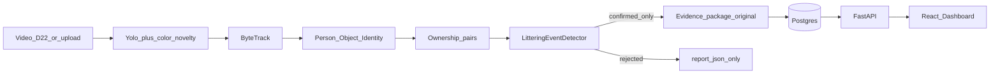
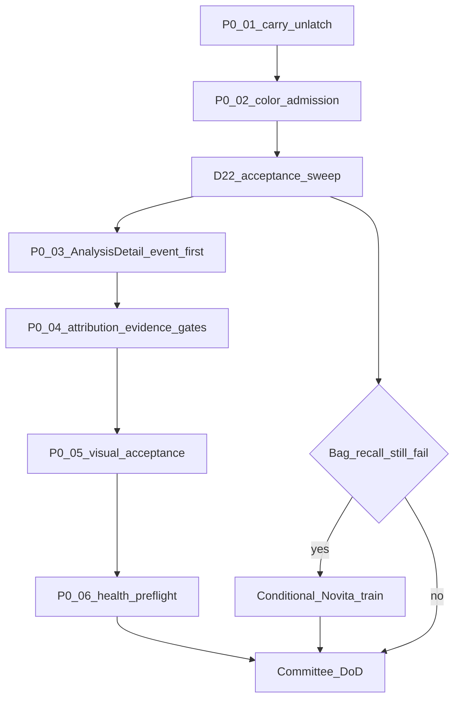

# MASTER REPAIR PLAN — Littering Detection System

**Document role:** Single authoritative repair plan for senior engineers.  
**Created:** 2026-09-11  
**Scope of this document:** Inspection + plan only. This file does **not** authorize silent product claims of “fixed.”  
**Sources treated as hypotheses (not truth):**  
- [`project_audit/MASTER_PROJECT_STATE_AND_REPAIR_PLAN.md`](MASTER_PROJECT_STATE_AND_REPAIR_PLAN.md) (Claude forensic audit)  
- Prior [`MASTER_REPAIR_PLAN.md`](MASTER_REPAIR_PLAN.md) seam audit (2026-09-09) — superseded by this document for repair priority  
- Phase/audit reports under `phase*_runs/`, `.audit/`, `_archive/audit_reports/`  

**Independently verified against current tree (2026-09-11):** key FSM, semantic-waste gate, evidence path, and dashboard claims below are tagged with proof levels.

**Proof legend (use everywhere):**  
`CODE VERIFIED` · `UNIT VERIFIED` · `INTEGRATION VERIFIED` · `RUNTIME VERIFIED` · `REAL-VIDEO VERIFIED` · `DATABASE VERIFIED` · `DASHBOARD VERIFIED` · `HISTORICAL` · `UNPROVEN` · `NOT PROVEN` · `FAILED`

---

# EXECUTIVE VERDICT

**Is the project ready for a real committee demonstration? NO.**

The product goal is correct and largely reflected in architecture: detect people and waste, track stable identities, own waste to a person, recognize carry → release → ground → departure, persist evidence, and show an **event-focused** Dashboard result.

What blocks readiness today is not “missing AI research” and not a total rewrite. It is a small set of **product-breaking defects**:

1. **TEMPORAL LOGIC / CODE (P0):** After a real put-down near the actor’s feet, `carried` often never clears because `bag_below_feet` uses a 5% person-height margin while ground evidence uses a 40% margin. Release criteria then cannot fire → `NO_RELEASE_TRANSITION` with `carry_score=1.0`, `release_score=0.0`. **CODE VERIFIED** in current [`littering_event_detector.py`](../littering_event_detector.py). Adaptive tuning **cannot** fix this (**CODE VERIFIED** — latch margin is not tunable).

2. **DETECTION ADMISSION / CODE (P0):** `_is_semantic_waste()` admits only `source=="yolo"`. Color/HSV detections (historically how yellow bags confirmed) cannot enter pairs/FSM; novelty stays out (correct) but color is incorrectly treated as permanently non-semantic. Fallback confidence discount is **DORMANT**. **CODE VERIFIED.**

3. **END-TO-END CONFIRMATION:** When `confirmed_violations==0`, analysis writes **zero** `events` / `evidence` rows (**CODE VERIFIED** in [`backend/routers/analysis.py`](../backend/routers/analysis.py)). Downstream evidence/Dashboard correctness is therefore **NOT PROVEN** on live data until at least one real confirmation exists. Prior Claude DB snapshot claimed 0/0 rows — treat as **HISTORICAL / NOT PROVEN** until re-queried in the repair execution phase.

4. **DASHBOARD / UI (P0 on AnalysisDetail):** EventDetail / VideoAnalysisPage correctly prioritize the event clip via `ForensicAssetPanel` (**CODE VERIFIED**). [`AnalysisDetail.tsx`](../dashboard/src/pages/AnalysisDetail.tsx) still presents **Full AI Analyzed Video** as a primary equal grid — violates “full video is secondary technical artifact.”

5. **ATTRIBUTION / EVIDENCE / VISUAL / DEPLOY:** Older seam bugs (NULL stable UIDs, `[0]` violation pick, open ingest, box flood, `lap` ImportError jobs) are partially addressed in source. They remain **P0 proof gates** the moment confirmations return — a previous agent saying “fixed” is not proof.

**Training is NOT assumed.** Novita (~$100) is gated behind a post-P0 real-video recall sweep. Do not spend budget on training to paper over the carry-latch or semantic-admission bugs.

**Smallest safe change principle:** Fix the carry unlatch predicate; re-admit discounted color (not novelty); make AnalysisDetail event-first; then prove person+waste+time+evidence on `D:\22` through DB and Dashboard. Preserve Layer-2 ownership/identity behavior.

---

# CURRENT PROJECT STATE

## Product contract (non-negotiable)

| Situation | Required system outcome |
|---|---|
| Person walks through, does nothing | **NO EVENT** |
| Person carries waste | Identify **which** waste belongs to that person |
| Person drops waste on ground and leaves it | **CONFIRMED LITTERING** with actual person + actual waste + actual time |
| Person puts waste in bin | **NOT** ground-littering confirmation |
| Person drops then picks up | **NOT** final violation (`PICKED_BACK_UP`) |
| Multiple people | Correct actor only |
| Multiple objects, one released | That exact object only |

**Primary user result:** exact time, actor, waste, short event clip, full-body, face (when available), waste image.  
**Secondary:** full analyzed video (technical review only).  
**Normal viz:** one **current** box per active track — no historical box piles, no proposal=WASTE, no evidence of unrelated passersby.

## Target architecture (preserve)

```
DETECTION → TRACKING → STABLE IDENTITY → PERSON/OBJECT OWNERSHIP
  → TEMPORAL EVENT RECOGNITION → EVIDENCE → DATABASE → API → DASHBOARD
```

Rules: Detection / tracking / rendering / evidence / Dashboard **do not invent** littering or actors. Database stores authoritative event truth. FSM decides littering.



## Entry points

| Path | Orchestration | Shared core |
|---|---|---|
| Upload analysis | [`backend/routers/analysis.py`](../backend/routers/analysis.py) `_run_video_analysis_job` | `InferencePipeline` + `AdaptiveEventDetector` / `LitteringEventDetector` |
| Live camera | [`scripts/run_pipeline.py`](../scripts/run_pipeline.py) | Same inference core; optional authenticated `POST /api/events` |

## Problem-type matrix (how to classify before fixing)

| Failure symptom | Most likely type (current evidence) | Training needed? |
|---|---|---|
| Reach CARRIED, never RELEASE / `NO_RELEASE_TRANSITION` | **TEMPORAL LOGIC / CODE** | No |
| Yellow bag worked historically, now never pairs | **CODE** (admission gate) | No (unless YOLO still misses after color re-admit) |
| Red bag miss / no track | **MODEL** and/or **CODE** latch | Maybe — only after P0 fixes + sweep |
| Wrong person / wrong object in evidence | **ARCH / CODE** (rebind, UID drop, UI `[0]`) | No |
| Missing screenshots / clip | **CODE** (no confirm) or evidence writer bug after confirm | No |
| Full video as primary result | **DASHBOARD/UI** | No |
| Thousands of boxes | **DASHBOARD/UI / RENDER** (or debug overlay) | No |
| Proposal treated as waste event | **CODE** (must stay gated) | No |
| Tests pass, product fails | **TESTING / PROCESS** | No |
| Backend/DB/Dashboard disagree | **DEPLOYMENT / INTEGRATION** | No |
| `lap` ImportError job failures | **DEPLOYMENT** | No |

## What is actually broken (now)

| Item | Type | Proof |
|---|---|---|
| Carry→release latch (`bag_below_feet` 0.05 vs `near_ground_plane` 0.40) | TEMPORAL LOGIC / CODE | CODE VERIFIED |
| YOLO-only `_is_semantic_waste`; color cannot confirm | CODE | CODE VERIFIED |
| 0 confirmed ⇒ 0 Event/Evidence rows | CODE / INTEGRATION | CODE VERIFIED |
| AnalysisDetail full analyzed video primary | DASHBOARD/UI | CODE VERIFIED |
| Core acceptance on real put-down near feet | PRODUCT | FAILED (HISTORICAL DB job 3 / learning.json patterns); re-run required for fresh DATABASE VERIFIED |

## What is only historical

- Aug-31 `.audit/runs_nov_cont/IMG_5117` yellow-bag `VIOLATION_CONFIRMED` via color-only detections (pre YOLO-only gate).
- Titles like `FINAL_MISSION_REPORT`, `FINAL_HARDENING_REPORT`, “all blockers resolved.”
- Commit-message claims “139 passed” without re-run this planning pass.
- Older MASTER_REPAIR_PLAN claim that EventDetail still uses full video as primary — **CONTRADICTED** by current `ForensicAssetPanel` usage.
- Claude audit’s live DB “0 events / 0 evidence” snapshot — **NOT PROVEN** today until re-queried.

## What is already healthy and must be preserved

- Pipeline shape and Layer separation (detect ≠ littering).
- Semantic vs proposal **concept** (proposals must never silently become event truth).
- Carry-time freeze of actor/object IDs; `_select_primary_associations`; `OTHER_PERSON_CLOSER`.
- Explicit rejection taxonomy (`NO_RELEASE_TRANSITION`, `PICKED_BACK_UP`, `BIN_ZONE_DEPOSIT`, etc.).
- Evidence package from **original** video ([`inference/visualization/evidence_package.py`](../inference/visualization/evidence_package.py)).
- `selectDetectorViolation` (no blind `[0]` when multiple violations).
- ForensicAssetPanel event-clip-first design on EventDetail / VideoAnalysisPage.
- Docker bind-mount of `D:\HO` → `/app` (host/container code parity when mount holds).
- ByteTrack + MoveNet role (not the headline failure mode).

## What is partially working

- Adaptive 3-tier tuner (useful defense-in-depth; **cannot** fix carry latch).
- Bin-zone machinery (code exists; default `bin_zones` empty → path mostly idle).
- Renderer “one current box per track” intent ([`tracking_visualizer.py`](../inference/visualization/tracking_visualizer.py), supervision annotator) — needs **DASHBOARD VERIFIED**.
- Stable UID fields on Event model + analysis persistence wiring — needs **DATABASE VERIFIED** on real confirms.
- Pick-up / regrab → `PICKED_BACK_UP` path — unit-covered; needs real-video proof.

## What is unproven / NOT PROVEN

- Live Postgres event/evidence counts **today**.
- Red-bag failure mechanism on a named clip after P0-01 (class-agnostic latch is CODE VERIFIED; clip-specific cause UNPROVEN).
- Multi-person real-video ground truth in `D:\22` (acceptance matrix incomplete).
- Evidence crop/clip correctness on a real confirmed Dashboard event.
- Whether older NULL-UID / adaptive-dedup evidence-drop bugs still reproduce after recent commits.
- Visual “thousands of boxes” still present in current analyzed.mp4.
- Need for Novita training (gated).

## Real data and runtime notes

- **Videos:** `D:\22` — 22 videos + 2 JPGs (e.g. `IMG_5117`, `IMG_5305`, `A/C/D/M.MOV`, …). No in-folder GT labels.
- **Compose:** mounts `D:/W` as `/data/W:ro`; **does not** mount `D:\22` — validation must upload, bind-mount, or run host-side.
- **Weights:** `inference/detection/weights/{best.pt,garbage_bag_v2.pt,taco_transfer_v1.pt,yolov8n.pt}`.
- **Datasets:** Roboflow colored bags (1 class `Garbage Bag`), TACO YOLO, `unified_v1`.
- **Novita:** ~$100 available; **no in-repo Novita scripts**; credentials must come from the operator when/if training gate fires.

---

# P0 / P1 / P2 — AUTHORITATIVE REPAIR ITEMS

Execution order after this document:



---

## REPAIR-P0-01 — Unstick carry → release (headline)

| Field | Content |
|---|---|
| **ID** | REPAIR-P0-01 |
| **Priority** | P0 — product-breaking (MISSED LITTERING EVENT) |
| **Problem** | Real littering reaches `BAG_CARRIED` then never releases; candidates die as `NO_RELEASE_TRANSITION` with `release_score=0.0`. |
| **Root cause** | In `_evaluate_pair`, `bag_below_feet` uses `bag_move_norm` (0.05·ph) while `near_ground_plane` uses `ground_plane_margin_ratio` (0.40·ph). `carried = (wrist_near or (carry_zone and not bag_below_feet)) and …`. Grounded bags inside the generous carry zone stay `carried=True`. All three `_release_detected` criteria require `not carried` / `not smooth_carried` (feet streak also needs `not info.carried`). |
| **Affected files** | [`littering_event_detector.py`](../littering_event_detector.py), [`config/events.yaml`](../config/events.yaml) |
| **Affected functions** | `_evaluate_pair` (`bag_below_feet`, `carried`), `_release_detected`, config defaults |
| **Affected layers** | TEMPORAL EVENT RECOGNITION (Layer 2) |
| **Problem type** | TEMPORAL LOGIC / CODE |
| **Current behavior** | Put-down near feet while person remains nearby → permanent `BAG_CARRIED`; adaptive tiers report identical `NO_RELEASE_TRANSITION`. |
| **Desired behavior** | Object the pipeline already treats as on the actor ground plane (`near_ground_plane`) must clear the carry-zone latch so release/stationary/depart can proceed when other gates allow. |
| **Repair strategy** | **Smallest safe change:** For the carry-zone exclusion inside `carried`, reuse `near_ground_plane` (same `ground_plane_margin_ratio`), **or** compute `bag_below_feet` with that same margin. Keep `bag_move_norm` only for anti-furniture **handledness** motion checks. Do **not** weaken `moves_with_person` or `wrist_near`. Expose `ground_plane_margin_ratio` explicitly in `events.yaml` (currently omitted → dataclass default). Add a one-line comment that the two ground judgments must not disagree by ~8×. |
| **Dependencies** | None (first fix). |
| **Regression risks** | Standing next to a static bag could churn carry/release if motion/wrist gates are accidentally loosened — **do not loosen them**. Mitigate with unit cases: passer-by near grounded bag → NO EVENT; true carry then drop → release. |
| **Tests required** | New unit: bag centroid in `near_ground_plane` band but outside old 0.05 band → `carried` becomes False and release can fire. Keep existing carry-only / non-carried rejection tests green. |
| **Real-video proof required** | `D:\22\IMG_5117.MOV` (and at least one other clear ground-litter clip): `confirmed_violations >= 1` when human GT is litter; report shows non-null release/ground frames. |
| **Database proof required** | New `events` row with non-null actor/object identity fields; matching `evidence` row with clip + person + waste paths. |
| **Dashboard proof required** | EventDetail / analysis surfaces show that event’s clip and crops — not a passerby. |
| **Rollback strategy** | Revert the single predicate/margin change in `littering_event_detector.py` + yaml; re-run `IMG_5117` to confirm prior rejection mode returns. |

---

## REPAIR-P0-02 — Re-admit discounted color path (yellow-bag regression)

| Field | Content |
|---|---|
| **ID** | REPAIR-P0-02 |
| **Priority** | P0 — product-breaking (MISSED LITTERING; PROPOSAL≠WASTE must stay true) |
| **Problem** | Yellow-bag (and any YOLO-miss color bag) cannot form semantic pairs after `_is_semantic_waste` YOLO-only gate; historical confirms used `source=color`. |
| **Root cause** | `_is_semantic_waste` returns False unless `source=="yolo"`; only `semantic_bags` advance pairs. Color detections still appear in telemetry/`object_sources` but never in FSM. `_compute_evidence` fallback discount is unreachable (**DORMANT**). |
| **Affected files** | [`littering_event_detector.py`](../littering_event_detector.py) (`_is_semantic_waste`, pair admission, `_compute_evidence`) |
| **Affected functions** | `_is_semantic_waste`, `update` semantic/proposal split, fallback frame accounting |
| **Affected layers** | DETECTION admission → OWNERSHIP → TEMPORAL |
| **Problem type** | CODE (admission); may interact with MODEL recall |
| **Current behavior** | Color/novelty → `proposal_bags` only; never confirm. Novelty exclusion is correct; color exclusion is over-broad. |
| **Desired behavior** | `source=="color"` may enter pair/FSM as a **discounted** path (existing fallback factor). `novelty` / `detected_object` / `color_candidate*` class names remain **proposal-only forever** and must never alone confirm. |
| **Repair strategy** | Weaken gate to admit `source in ("yolo","color")` with existing non-candidate class filters; keep novelty out. Verify `fallback_frames` increments and discount applies. Do **not** let proposals render as WASTE labels. |
| **Dependencies** | Prefer after or with P0-01 (otherwise color pairs may also stick in CARRIED). |
| **Regression risks** | HSV false positives → false littering. Mitigate: keep confidence discount; require full temporal chain; add hard-negative tests (colored clothing, signs). Re-validate passer-by clips in `D:\22`. |
| **Tests required** | Unit: color-sourced bag can enter pair; novelty cannot confirm; discount applied when fallback_frames > 0. |
| **Real-video proof required** | Yellow-bag / color-dominant clip confirms with correct object; novelty-only scene does not invent waste events. |
| **Database proof required** | Event object class/source metadata consistent; evidence waste crop matches color bag. |
| **Dashboard proof required** | Waste evidence shows the colored bag, not a gray proposal blob. |
| **Rollback strategy** | Restore YOLO-only `_is_semantic_waste`; document temporary loss of color-only recall. |

---

## REPAIR-P0-03 — AnalysisDetail event-first (full video secondary)

| Field | Content |
|---|---|
| **ID** | REPAIR-P0-03 |
| **Priority** | P0 — FULL VIDEO = PRIMARY RESULT |
| **Problem** | Committee/operator path via AnalysisDetail still leads with Original + Full AI Analyzed Video. |
| **Root cause** | [`dashboard/src/pages/AnalysisDetail.tsx`](../dashboard/src/pages/AnalysisDetail.tsx) primary grid (~L189–214) elevates analyzed video; ForensicAssetPanel is not first-class there. |
| **Affected files** | `AnalysisDetail.tsx`; optionally reuse `DebugReviewPanel.tsx`, `ForensicAssetPanel.tsx` |
| **Affected functions** | Page layout / render order |
| **Affected layers** | DASHBOARD |
| **Problem type** | DASHBOARD/UI |
| **Current behavior** | Full analyzed video is co-equal primary content. |
| **Desired behavior** | Confirmed events + ForensicAssetPanel (clip, person, face, waste) first; analyzed video collapsed under Technical Review (match EventDetail / VideoAnalysisPage). Analyzed video remains available. |
| **Repair strategy** | Reorder UI; demote analyzed/original to `DebugReviewPanel` or equivalent `defaultOpen={false}`; list job events with forensic panels above. |
| **Dependencies** | Meaningful after P0-01/02 produce events; can land in parallel once events exist in fixtures. |
| **Regression risks** | Engineers lose quick access to annotated video — keep one-click expand. |
| **Tests required** | Component/UI test or Playwright: with mock event, forensic panel visible without expanding debug; analyzed video not in initial primary viewport. |
| **Real-video proof required** | Upload real confirmed job; operator finds violation without scrubbing full analyzed video. |
| **Database proof required** | N/A (UI), but event IDs shown must match DB. |
| **Dashboard proof required** | **Required** — browser verification. |
| **Rollback strategy** | Revert layout commit. |

---

## REPAIR-P0-04 — Attribution, evidence, API/DB truth gates

| Field | Content |
|---|---|
| **ID** | REPAIR-P0-04 |
| **Priority** | P0 — WRONG ACTOR / WRONG OBJECT / WRONG EVIDENCE / WRONG FACE / WRONG CLIP / DB↔API↔DASHBOARD MISMATCH |
| **Problem** | Once confirmations return, historical seam bugs may reappear: NULL stable UIDs, adaptive-tier evidence drop, Dashboard wrong violation match, open or mismatched ingest. |
| **Root cause** | Mixed: prior live-ingest schema gaps, adaptive self-dedup, UI `[0]` selection (largely code-fixed), evidence package ID matching. **Current status of each is NOT PROVEN on live confirms.** |
| **Affected files** | [`adaptive_tuner.py`](../adaptive_tuner.py), [`backend/routers/analysis.py`](../backend/routers/analysis.py), [`backend/routers/events.py`](../backend/routers/events.py), [`evidence_package.py`](../inference/visualization/evidence_package.py), [`detectorEvent.ts`](../dashboard/src/lib/detectorEvent.ts), EventDetail / VideoAnalysisPage |
| **Affected functions** | Adaptive merge/dedup; Event/Evidence insert; `selectDetectorViolation`; package ID anchors |
| **Affected layers** | IDENTITY persistence → EVIDENCE → DB → API → DASHBOARD |
| **Problem type** | CODE / INTEGRATION / DEPLOYMENT |
| **Current behavior** | Source contains UID persistence and `selectDetectorViolation`; cannot claim production correctness without confirmed rows. |
| **Desired behavior** | Every confirmed event: non-null `event_actor_person_uid` + `event_object_uid` (or documented legacy-only path); evidence files belong to frozen IDs; API review payload matches DB; Dashboard matches by UID/track, never invents actor. |
| **Repair strategy** | **Proof-first gates** after P0-01/02: SQL assertions on new jobs; API GET parity; browser EventDetail multi-event job test; if NULL UIDs or evidence drop reproduce, fix the specific seam (do not widen FSM). Harden pair rebind only if multi-object misfires (**CODE VERIFIED** risk at `other[0]`). |
| **Dependencies** | P0-01, P0-02 (need real events). |
| **Regression risks** | Over-strict UID requirements rejecting legacy rows — gate new jobs only. |
| **Tests required** | Integration: confirmed event → DB non-null UIDs → evidence paths exist → API returns same IDs → `selectDetectorViolation` picks matching violation in multi-event fixture. |
| **Real-video proof required** | Multi-person and multi-object clips from `D:\22` when available; at minimum one litter + one passer-by in same video if present. |
| **Database proof required** | `SELECT` non-null UIDs; evidence paths resolve on disk under `evidence_store`. |
| **Dashboard proof required** | Correct person/waste/face/clip; opening event B never shows event A’s detector card. |
| **Rollback strategy** | Per-seam revert; keep FSM fixes. |

---

## REPAIR-P0-05 — Visual acceptance (boxes / proposals)

| Field | Content |
|---|---|
| **ID** | REPAIR-P0-05 |
| **Priority** | P0 — THOUSANDS OF BOXES / PROPOSAL = WASTE |
| **Problem** | Historical visual pollution; proposals confused with waste; evidence with wrong overlays. |
| **Root cause** | Prior annotated-frame evidence and/or drawing all proposals as strong boxes. Current code claims current-frame-only tracks + faint proposals (**CODE VERIFIED** intent). Live visual state **NOT PROVEN**. |
| **Affected files** | [`tracking_visualizer.py`](../inference/visualization/tracking_visualizer.py), [`supervision_annotator.py`](../inference/visualization/supervision_annotator.py), [`frame_analysis.py`](../inference/visualization/frame_analysis.py), [`evidence_package.py`](../inference/visualization/evidence_package.py) |
| **Affected functions** | Annotators; evidence still drawing (actor+object only) |
| **Affected layers** | RENDER / EVIDENCE (must not decide littering) |
| **Problem type** | DASHBOARD/UI / RENDER |
| **Current behavior** | Analyzed video may show all current tracks + faint proposals (busy but not historical stacks). Evidence stills should be actor+object only. |
| **Desired behavior** | Normal: one current box per active track. Event stills/clip packaging: **actual actor + actual event object only**. Proposals never labeled WASTE. No accumulated historical boxes. |
| **Repair strategy** | Browser/frame-sample proof on a completed job; if flood returns, fix annotator only (preserve Layer-2). Never expand proposal authority to “fix” visuals. |
| **Dependencies** | Needs a completed analysis job after P0-01/02. |
| **Regression risks** | Hiding non-actor tracks on analyzed video may reduce debug value — keep full current tracks on analyzed; restrict on evidence stills. |
| **Tests required** | Existing renderer tests (`test_renderer_boxes`, `test_visualization`); add assertion proposals not labeled WASTE. |
| **Real-video proof required** | Sample frames from analyzed.mp4 + evidence stills for a confirmed event. |
| **Database proof required** | Evidence paths point at clean stills (spot-check files). |
| **Dashboard proof required** | **Required** — visual inspection in browser. |
| **Rollback strategy** | Revert annotator changes only. |

---

## REPAIR-P0-06 — Docker / runtime readiness

| Field | Content |
|---|---|
| **ID** | REPAIR-P0-06 |
| **Priority** | P0 — DEPLOYMENT (jobs fail before AI runs; truth mismatch risk) |
| **Problem** | Historical jobs failed with `No module named 'lap'`; validation corpus `D:\22` not mounted in Compose. |
| **Root cause** | No preflight gating job acceptance on detector/tracker imports; validation path friction. |
| **Affected files** | [`backend/main.py`](../backend/main.py) `/health`, [`docker-compose.yml`](../docker-compose.yml), Dockerfile deps |
| **Affected functions** | Startup / health |
| **Affected layers** | DEPLOYMENT / RUNTIME |
| **Problem type** | DEPLOYMENT |
| **Current behavior** | `/health` liveness only (**CODE VERIFIED** pattern historically); `lap` may be present now (**NOT PROVEN** this session). |
| **Desired behavior** | Readiness fails until `lap`, ultralytics, and weight files import/load; Compose documents or mounts `D:\22` for validation (read-only). |
| **Repair strategy** | Extend health/readiness with import + weight checks; add optional `D:/22:/data/22:ro` mount; CI/smoke script. |
| **Dependencies** | Independent of FSM; do before committee demo. |
| **Regression risks** | Over-strict health blocking boot — check weights paths carefully. |
| **Tests required** | Container smoke: health 200 only when deps OK. |
| **Real-video proof required** | Job from mounted/uploaded `D:\22` completes without ImportError. |
| **Database proof required** | No new `failed` jobs with missing-module errors in demo window. |
| **Dashboard proof required** | Upload path works against healthy backend. |
| **Rollback strategy** | Revert health checks; keep deps pinned in image. |

---

## REPAIR-P1-01 — Permanent unit lock for feet put-down geometry

| Field | Content |
|---|---|
| **ID** | REPAIR-P1-01 |
| **Priority** | P1 |
| **Problem** | Carry-latch bug regressed once already (“old rule” comment); suite lacked the exact geometry. |
| **Root cause** | Missing regression test for near-ground / outside-tight-feet-band put-down. |
| **Affected files** | [`tests/test_littering_event_detector.py`](../tests/test_littering_event_detector.py) |
| **Affected functions** | Synthetic pair geometry helpers |
| **Affected layers** | TEMPORAL / TEST |
| **Problem type** | CODE / TESTING |
| **Current behavior** | Related tests exist but not this geometry class. |
| **Desired behavior** | Permanent failing-red-before-fix test that encodes P0-01. |
| **Repair strategy** | Land with P0-01. |
| **Dependencies** | P0-01 |
| **Regression risks** | Over-fitted synthetic coords — derive from real bbox ratios noted in audits (e.g. IMG_5305 comments). |
| **Tests required** | This item **is** the test. |
| **Real-video / DB / Dashboard proof** | Not sufficient alone; complements P0-01 proofs. |
| **Rollback strategy** | N/A |

---

## REPAIR-P1-02 — Multi-object rebind hardening

| Field | Content |
|---|---|
| **ID** | REPAIR-P1-02 |
| **Priority** | P1 — WRONG OBJECT risk |
| **Problem** | Orphaned pair rebind uses `same_class[0]` else `other[0]` — first-candidate selection. |
| **Root cause** | Designed fallback in [`littering_event_detector.py`](../littering_event_detector.py) ~1136–1172; misfire **NOT PROVEN** on real video. |
| **Affected files** | `littering_event_detector.py`, identity managers |
| **Affected functions** | Pair rebind / slot fallback |
| **Affected layers** | OWNERSHIP / IDENTITY |
| **Problem type** | ARCHITECTURAL RISK / CODE |
| **Current behavior** | Can rebind to wrong physical object under crowding. |
| **Desired behavior** | Rebind only with score/IoU/class continuity above threshold; else end pair without stealing another object. |
| **Repair strategy** | After P0, reproduce with multi-object `D:\22` clip; if FAILED, replace first-candidate with scored match; **protect Layer-2 ownership locks**. |
| **Dependencies** | P0-01/02; acceptance matrix |
| **Regression risks** | Stricter rebind → more lost tracks mid-throw — tune carefully. |
| **Tests required** | Two objects one person; ID churn on object A must not attach event to object B. |
| **Real-video / DB / Dashboard proof** | Required if bug reproduces. |
| **Rollback strategy** | Restore prior rebind. |

---

## REPAIR-P1-03 — Bin-zone operator path

| Field | Content |
|---|---|
| **ID** | REPAIR-P1-03 |
| **Priority** | P1 — FALSE LITTERING (bin deposit) |
| **Problem** | Bin vs ground relies on `require_ground_confirmation` + empty default `bin_zones`; low bins can false-confirm. |
| **Root cause** | No configured polygons; no bin detector. |
| **Affected files** | `config/events.yaml`, `littering_event_detector.py`, camera setup docs/UI |
| **Affected functions** | BinZone containment; confirm gate `BIN_ZONE_DEPOSIT` |
| **Affected layers** | TEMPORAL / CONFIG / UI |
| **Problem type** | CODE / ARCH (incomplete) |
| **Current behavior** | Path idle without zones. |
| **Desired behavior** | Demo/static camera can load bin polygons; deposits inside zone reject as bin use. |
| **Repair strategy** | Document + wire one config path; validate on a bin-disposal clip from `D:\22`. |
| **Dependencies** | P0-01 (need releases to reach confirm gate) |
| **Regression risks** | Mis-drawn zone → missed litter — keep ground-plane gate. |
| **Tests required** | Existing `test_bin_zone.py` + real bin clip. |
| **Real-video / DB / Dashboard proof** | Bin clip → no false confirm; ground litter still confirms. |
| **Rollback strategy** | Clear `bin_zones`. |

---

## REPAIR-P1-04 — `D:\22` acceptance manifest

| Field | Content |
|---|---|
| **ID** | REPAIR-P1-04 |
| **Priority** | P1 |
| **Problem** | No executable human GT matrix; agents “PASS” without product proof. |
| **Root cause** | Raw videos only under `D:\22`. |
| **Affected files** | New manifest under `project_audit/` or `evaluation/` (e.g. `D22_ACCEPTANCE.json`) |
| **Affected functions** | Eval harness scripts |
| **Affected layers** | TESTING / PROCESS |
| **Problem type** | DATASET / PROCESS |
| **Current behavior** | Scattered phase reports. |
| **Desired behavior** | Per-clip expected: `NO_EVENT` / `LITTER` / `BIN` / `PICKUP` / `MULTI_PERSON` + notes (bag color). |
| **Repair strategy** | Operator labels once; CI/script compares detector summary + optional DB. |
| **Dependencies** | Operator input for labels |
| **Regression risks** | Wrong labels → false confidence — dual-review critical clips. |
| **Tests required** | Harness exit non-zero on mismatch. |
| **Real-video proof required** | The matrix itself. |
| **DB / Dashboard proof** | Optional join for litter rows. |
| **Rollback strategy** | N/A |

---

## REPAIR-P1-05 — Architecture doc sync

| Field | Content |
|---|---|
| **ID** | REPAIR-P1-05 |
| **Priority** | P1 |
| **Problem** | [`docs/ARCHITECTURE.md`](../docs/ARCHITECTURE.md) still describes archived associator / old FSM / TemporalVoter as if live. |
| **Root cause** | Doc drift after archive. |
| **Affected files** | `docs/ARCHITECTURE.md` |
| **Affected layers** | DOCS |
| **Problem type** | PROCESS |
| **Repair strategy** | Rewrite diagram to `LitteringEventDetector` + Adaptive wrapper; mark archive dead. |
| **Dependencies** | None |
| **Tests / proofs** | Doc review only |
| **Rollback strategy** | Git revert doc |

---

## REPAIR-P2-01 — Archive / clutter hygiene

| Field | Content |
|---|---|
| **ID** | REPAIR-P2-01 |
| **Priority** | P2 |
| **Problem** | `_archive/` dead modules and root report clutter confuse “current truth.” |
| **Repair strategy** | After P0 stability window, delete or deeply archive dead code; stop treating `FINAL_*` titles as status. |
| **Do not** | Delete during P0; keep history readable. |

---

## REPAIR-P2-02 — Optional Supervision for draw hygiene

| Field | Content |
|---|---|
| **ID** | REPAIR-P2-02 |
| **Priority** | P2 |
| **Problem** | Custom draw code is maintenance-heavy. |
| **Repair strategy** | Only if P0-05 fails hygiene goals; Supervision for annotation only — **not** littering decisions. |

---

## REPAIR-P2-03 — External eval corpus (MIVIA-IWDD-500)

| Field | Content |
|---|---|
| **ID** | REPAIR-P2-03 |
| **Priority** | P2 |
| **Problem** | Adaptive learning on small personal set risks overfitting. |
| **Repair strategy** | Add as offline benchmark after P0; does not replace `D:\22` demo GT. |

---

## KEEP / WEAKEN / REPLACE / REMOVE-LATER / ADD (summary)

| Action | What |
|---|---|
| **KEEP** | Pipeline shape; FSM authority; semantic/proposal concept; identity freeze; ownership guards; original-video evidence package; ForensicAssetPanel intent; ByteTrack/MoveNet for now; bind-mount deploy |
| **REPLACE** | Carry-zone ground exclusion predicate (align to `near_ground_plane`) — REPAIR-P0-01 |
| **WEAKEN TO FALLBACK** | Color admission with discount — REPAIR-P0-02; novelty remains proposal-only |
| **ADD** | Geometry regression test; `D:\22` manifest; readiness health; AnalysisDetail event-first; proof gates P0-04/05 |
| **REMOVE-LATER** | Archived FSM/voter/associator copies; misleading FINAL report clutter |

---

# EXTERNAL TECHNOLOGY EVALUATION

| CURRENT | CANDIDATE | Solves | Does not solve | CPU/GPU | Integration | Risk | Recommendation |
|---|---|---|---|---|---|---|---|
| Custom annotators | Roboflow Supervision | Cleaner box/label drawing | Carry latch, ownership, FSM | Low CPU | Low | Low | **Optional P2** after visual proof fails |
| ByteTrack | BoT-SORT | Occlusion ID stability | Carry latch, color gate | Low–med | Med | Med (behavior change) | **Defer** until post-P0 ID churn REAL-VIDEO proven |
| ByteTrack | OC-SORT | Similar | Same | Low–med | Med | Med | **Defer** |
| ByteTrack | BoxMOT | Tracker swap convenience | Same | Low–med | Low–med | Med | **Defer** |
| None | DeepSORT / ReID | Long-term re-ID | Latch / admission / UI | Med GPU | Med–high | High complexity | **Not now** |
| Personal `D:\22` | MIVIA-IWDD-500 | Littering benchmark diversity | Code bugs | Data only | Med | Low | **P2 eval corpus** |
| Heuristic FSM | X3D / VideoMAE / Hiera | Learned drop action | Needs rearchitecture; won’t fix admission/UI | High GPU | High | High | **Not near-term** |

Do **not** replace components merely because newer tech exists. Current headline failures are **logic and admission**, not tracker brand.

---

# TRAINING GATE (conditional — NOT default)

## What does NOT require training

- REPAIR-P0-01 carry latch  
- REPAIR-P0-02 color admission (code path)  
- REPAIR-P0-03 UI  
- REPAIR-P0-04/05/06 proof and deploy gates  
- Bin-zone config, docs, rebind hardening  

## What MAY require training

Only if, **after** P0-01 + P0-02 and a full `D:\22` sweep:

- Systematic miss of red/yellow bags on **YOLO** even when visible, **and** color path insufficient for those clips, **and** event-level recall remains below demo bar.

### Concrete training plan (activate only if gate fires)

| Item | Plan |
|---|---|
| **Model** | Ultralytics YOLOv8 bag/litter head (start from `garbage_bag_v2` or `best.pt` — pick by sweep failure mode) |
| **Data** | `datasets/roboflow_colored_bags` + TACO/unified bag/litter + **hard mines from `D:\22`** frames |
| **Labels** | YOLO boxes; target classes: at minimum `Garbage Bag` / `bag`; keep litter classes if `best.pt` path |
| **Positives** | Carried bags, grounded bags, thrown bags, multiple colors |
| **Hard negatives** | Passers with no waste, bin interiors, furniture, colored clothing, novelty blobs |
| **Split** | Train/val from public sets; **hold out** designated `D:\22` clips as test (never train) |
| **Augmentation** | Mosaic, HSV, scale, motion blur — moderate; preserve color cues for bag discrimination |
| **Metrics** | Box mAP@0.5; **event-level** recall/precision on holdout after full pipeline |
| **CPU/GPU** | Try local/CPU or existing scripts first (`scripts/train_garbage_bag_v2.py`); Novita GPU only if wall-clock requires |
| **Novita estimate** | Stay within ~$100; short fine-tune runs; stop if no event-level gain |
| **Validation before replace** | Shadow: run holdout through pipeline with candidate weights **without** deleting current weights; compare `report_json` + Dashboard on same jobs; only then copy into `inference/detection/weights/` |
| **Credentials** | **Do not invent.** When gate fires, request from operator: Novita API key, project/org id, preferred GPU SKU, billing cap confirmation |

---

# ANSWERS TO THE 16 PLANNING QUESTIONS

1. **Actually broken:** Carry→release latch; YOLO-only semantic admission (color blocked); AnalysisDetail full-video primacy; end-to-end confirm→evidence unproven on live data.  
2. **Only historical:** Pre-gate yellow confirms; FINAL_* readiness claims; older EventDetail-full-video finding (fixed in EventDetail source); unaudited “N tests passed.”  
3. **Healthy / preserve:** Architecture layers; FSM as authority; proposal≠waste concept; identity freeze; ownership guards; original evidence package; ForensicAssetPanel on EventDetail; bind-mount parity.  
4. **Partially working:** Adaptive tuner; bin zones (unconfigured); renderer current-box intent; UID API fields.  
5. **Unproven:** Today’s DB counts; red-bag clip-specific root; multi-person GT; evidence correctness on real confirms; box-flood still present; Novita need.  
6. **Fix first:** REPAIR-P0-01, then P0-02, then `D:\22` sweep.  
7. **Replace:** Ground-exclusion used inside `carried` (align to `near_ground_plane`).  
8. **Weaken to fallback:** Color → discounted semantic path; novelty stays proposal.  
9. **Remove later:** Archived dead FSM/voter/associator; status-misleading report clutter.  
10. **Add:** Geometry regression test; acceptance manifest; readiness health; AnalysisDetail event-first; proof gates.  
11. **Requires training:** Only if post-P0 bag recall still fails systematic MODEL test.  
12. **Does not require training:** All P0 logic/UI/deploy items above.  
13. **Real-video tests:** `D:\22` litter / pass / bin / pickup / multi-object; especially `IMG_5117`, red-bag candidates (e.g. `IMG_5305`).  
14. **Dashboard tests:** EventDetail forensic primary; AnalysisDetail after P0-03; no wrong-event attribution; visual box policy.  
15. **Database proofs:** Non-zero correct events; non-null UIDs; evidence paths; no orphan mismatches.  
16. **Docker/runtime proofs:** Health/readiness; no `lap` failures; host/container same code; validation path for `D:\22`.

---

# DEFINITION OF DONE

A repair item is **done** only when its required proofs in the table above are marked with evidence (command, job id, screenshot path, or SQL). Pytest green alone is **not** done.

## Core littering scenario — mandatory end-to-end proof

```
REAL VIDEO (D:\22)
  → correct person track/UID
  → correct waste track/UID
  → correct ownership
  → CARRIED
  → RELEASE
  → GROUND
  → DEPARTURE (or abandonment)
  → VIOLATION_CONFIRMED
  → correct evidence package (clip, person, face-if-available, waste, sequence stills)
  → correct DB Event + Evidence rows
  → correct API payload
  → correct Dashboard ForensicAssetPanel (event-focused; full analyzed video secondary)
```

If any hop fails → **NOT DONE**. If not measured → **NOT PROVEN**.

## Critical visual acceptance

- Normal annotated video: **one current box per active track** (no historical box piles).  
- Event evidence: **actual actor + actual waste only**.  
- Proposals never presented as WASTE truth.  
- No unrelated passerby as evidence.  
- No random screenshots.  
- Full analyzed video is **not** the primary violation result.

---

# COMMITTEE DEMONSTRATION CHECKLIST

Use this checklist only after P0 repairs. Check each box only with proof tags.

### Environment

- [ ] Backend healthy with dependency readiness (**RUNTIME VERIFIED**)  
- [ ] Postgres up; `D:\HO` bind-mount active (**RUNTIME VERIFIED**)  
- [ ] Dashboard reachable; API proxy works (**DASHBOARD VERIFIED**)  
- [ ] `D:\22` accessible for demo uploads or mount (**RUNTIME VERIFIED**)  

### AI / product behavior on real video

- [ ] Passer-by clip → **NO EVENT** (**REAL-VIDEO + DATABASE VERIFIED**)  
- [ ] Ground litter clip → **CONFIRMED** with correct person + waste + time (**REAL-VIDEO + DATABASE + DASHBOARD VERIFIED**)  
- [ ] Yellow/color bag scenario (if in demo set) → correct object (**REAL-VIDEO VERIFIED**)  
- [ ] Red/dark bag scenario (if in demo set) → correct object **or** documented residual MODEL gap (**REAL-VIDEO VERIFIED** / **NOT PROVEN**)  
- [ ] Bin disposal → not confirmed as ground litter (**REAL-VIDEO VERIFIED**)  
- [ ] Drop + pick up → not final violation (**REAL-VIDEO VERIFIED**)  
- [ ] Multi-person (if available) → correct actor (**REAL-VIDEO VERIFIED** or **NOT PROVEN** if no GT)  

### Evidence & UI

- [ ] Event clip present and spans carry→depart (**DASHBOARD VERIFIED**)  
- [ ] Person full-body crop is the actor (**DASHBOARD VERIFIED**)  
- [ ] Face present when visible; else honest empty (**DASHBOARD VERIFIED**)  
- [ ] Waste crop is the thrown object (**DASHBOARD VERIFIED**)  
- [ ] AnalysisDetail is event-first; analyzed video secondary (**DASHBOARD VERIFIED**)  
- [ ] Visual: no thousands of boxes; proposals not WASTE (**DASHBOARD VERIFIED**)  

### Truth consistency

- [ ] DB Event UIDs match Dashboard labels (**DATABASE + DASHBOARD VERIFIED**)  
- [ ] API review payload matches DB (**INTEGRATION VERIFIED**)  
- [ ] `report_json` confirmed count matches Event row count (**DATABASE VERIFIED**)  
- [ ] No demo reliance on stage `PASS` labels alone  

### Training / budget

- [ ] Novita **not** spent unless training gate fired and operator provided credentials  
- [ ] If trained: shadow validation recorded before weight replace (**REAL-VIDEO VERIFIED**)  

### Explicit honesty

- [ ] Any unmet item left as **NOT PROVEN** or **FAILED** — never “fixed” without proof  

---

# STRICT PRIORITY REMINDER

**P0 includes any issue that can cause:** wrong actor, wrong object, missed littering, false littering, wrong event time, wrong evidence, wrong face, wrong event clip, proposal=waste, thousands of boxes, full video as primary result, DB/API/Dashboard truth mismatch.

**Do not implement product fixes from stale reports without re-proof.**  
**Do not treat this document as proof that repairs already landed** — this document is the plan.

---

*End of MASTER REPAIR PLAN. Next engineering step: execute REPAIR-P0-01 against current code, then continue the order above.*
